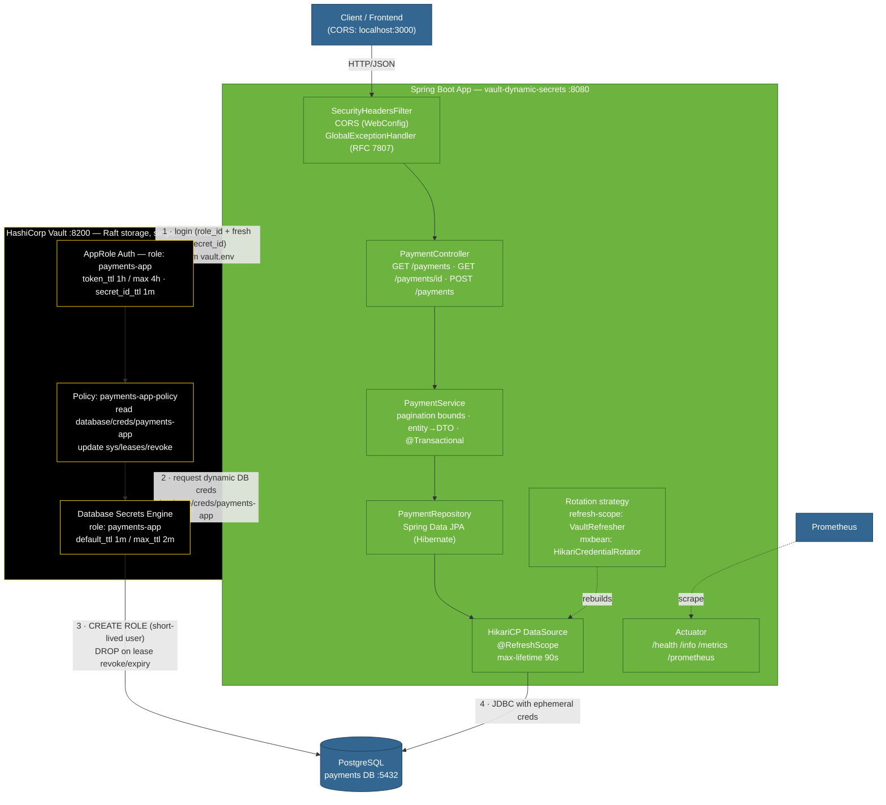

# vault-dynamic-secrets

A Spring Boot **4** (Java 21) payments API that gets its PostgreSQL credentials
**dynamically from HashiCorp Vault** — Vault mints a short-lived Postgres user on
demand, Spring Cloud Vault hot-swaps the connection pool when the lease expires,
and the app never sees a static DB password.

Persistence is **Spring Data JPA (Hibernate)** over the Vault-issued connection,
in a clean layered architecture (Controller → Service → Repository).

The service is production-hardened: AppRole auth, HikariCP tuning, response
compression, an explicit CORS allow-list, baseline security headers, bounded
pagination, RFC 7807 error bodies, graceful shutdown, and Actuator + Prometheus.

---

## Architecture

```text
client ──HTTP──▶ Payments API (:8080) ──JDBC──▶ PostgreSQL (:5432, db "payments")
                       │                              ▲
                       │ AppRole login                │ dynamic user created/dropped
                       ▼                              │ per lease (default_ttl 1m / max_ttl 2m)
                 Vault (:8200) ── database secrets engine ──┘
```



- **Auth:** AppRole. `role_id` is stable; a fresh `secret_id` (1-minute TTL) is
  minted at every launch by `run.sh`.
- **Rotation:** the DB role uses deliberately short TTLs (`default_ttl=1m`,
  `max_ttl=2m`) so you can watch credentials rotate. When a lease expires the app
  picks up the new credential using one of two **pluggable strategies**, selected
  by `app.vault.rotation-strategy`:

  | Strategy | Bean | Mechanism | Trade-off |
  |----------|------|-----------|-----------|
  | `refresh-scope` *(default)* | `VaultRefresher` + `@RefreshScope` `DataSource` | `ContextRefresher.refresh()` rebuilds the DataSource bean | Idiomatic Spring Cloud; rebuild is lazy (happens on the next request), and a refresh tears down everything `@RefreshScope` |
  | `mxbean` | `HikariCredentialRotator` | flips the lease `RENEW → ROTATE`, then `setUsername`/`setPassword` on the live HikariCP pool + `softEvictConnections()` | Lower overhead, immediate, no context teardown; talks directly to HikariCP |

  Both are verified end-to-end (see [Testing](#testing)). Exactly one is wired in
  at startup via `@ConditionalOnProperty`.

---

## Why dynamic secrets? (benefits, trade-offs, when to use)

Instead of a static DB username/password living in config, the app authenticates
to Vault and Vault **mints a brand-new, short-lived Postgres user on demand**.
The credential auto-expires and the connection pool is hot-swapped. The app never
holds a permanent DB password.

### Benefits

| Benefit | Why it matters |
|---|---|
| No static DB credentials | Nothing long-lived in config/env/git — removes the biggest secret-sprawl risk. |
| Auto-rotating & short-lived | A leaked credential is useless once its lease TTL passes. |
| Unique per app/instance | Each instance gets its own DB user → precise audit trail in `pg_stat_activity`. |
| Instant revocation | Revoke a lease → the Postgres role is dropped immediately; no fleet-wide password reset. |
| Least privilege + central audit | The Vault role pins exact grants; Vault logs every issuance. |
| Decoupled from deploys | Rotate secrets without rebuilding or redeploying. |

### Trade-offs

- **You now operate Vault** — HA, auto-unseal, storage, backups. It becomes critical-path infra.
- **Availability coupling** — if Vault is down, apps can't obtain/renew creds. Mitigate with HA Vault, a Vault Agent cache, and graceful degradation.
- **Connection-pool churn** — rotation rebuilds pools; keep `spring.datasource.hikari.max-lifetime` **below** the lease `max_ttl` (with the 1m/2m demo TTLs the pool can wedge on an expired user).
- **DB overhead** — frequent role create/drop; use realistic TTLs (hours, not one minute).

### Should you use it in production?

**Yes — this is a flagship Vault pattern — but not with the demo's settings.** For production:

- TTLs of **hours** (`default_ttl=1h`, `max_ttl=24h`), not 1m/2m.
- **HA Vault + auto-unseal** (cloud KMS), plus alerting on credential-issuance failures.
- `max-lifetime < max_ttl`, `spring.cloud.vault.fail-fast=true`, and code that tolerates a brief Vault outage.
- Consider a **Vault Agent sidecar** to cache and renew leases, shielding the app.

### Should you use it in microservices?

**Especially yes.** More services touching databases means static per-service
credentials become a rotation and sprawl nightmare. Dynamic secrets give
per-service (even per-instance) least-privilege credentials, centralized audit,
and instant revocation. Caveats:

- Vault must be **HA** — it is now shared, critical infrastructure.
- Give each service its **own AppRole + policy** (least privilege).
- Run a **Vault Agent sidecar** per pod to cut Vault load and latency.
- For a *tiny* system (1–2 services) the operational overhead may outweigh the
  benefit — a managed option (e.g. AWS Secrets Manager with RDS rotation) can be simpler.

---

## Alternatives to this approach

"Dynamic secrets" is a *pattern* (short-lived, generated-on-demand, auto-expiring
credentials). Vault + Spring Cloud Vault + AppRole is just one implementation.

> **Full implementation guide** — mechanism, config, and code for every option below
> (Vault Agent, VSO, CSI, cloud IAM DB auth, Secrets Manager, Infisical, Akeyless,
> Teleport/Boundary, SPIFFE/SPIRE, roll-your-own): see
> [docs/dynamic-secrets-implementations.md](docs/dynamic-secrets-implementations.md).

### Same idea, different Vault plumbing

| Option | How it works |
|---|---|
| **Vault Agent (sidecar)** | Sidecar auto-authenticates, renews the lease, and templates creds into a file/env — app stays Vault-unaware. |
| **Vault Secrets Operator / CSI** | Kubernetes operator or CSI driver syncs Vault dynamic secrets into native K8s Secrets / mounted volumes. |
| **Other auth methods** | Swap AppRole for Kubernetes / AWS-GCP-Azure IAM / JWT-OIDC / TLS-cert auth — no `role_id`/`secret_id` to manage. |
| **Other engines** | Vault also mints dynamic cloud creds (AWS/GCP/Azure STS), PKI certs, SSH keys, RabbitMQ, Consul, K8s tokens. |

### Managed / cloud-native (no Vault to operate)

| Platform | Mechanism |
|---|---|
| **AWS** | Secrets Manager + rotation Lambda, or **RDS IAM auth** (15-min STS token, no stored password) |
| **GCP** | Secret Manager + rotation, or **Cloud SQL IAM auth** via the Auth Proxy/connector |
| **Azure** | Key Vault + rotation, or **Azure AD auth** with a Managed Identity |

**IAM database authentication** is the cleanest: the DB trusts your cloud identity
and the app fetches a short-lived token — no stored DB credential at all.

### Other tools

- **Infisical / Akeyless** — SaaS dynamic secrets (no self-hosting).
- **CyberArk Conjur** — enterprise dynamic secrets.
- **Teleport / Boundary / StrongDM** — access brokers issuing ephemeral per-session creds/certs with full audit.
- **External Secrets Operator (ESO)** — K8s operator pulling from any backend (Vault, AWS, GCP, Azure, Akeyless…) into K8s Secrets.
- **SPIFFE/SPIRE** — short-lived workload identities (SVIDs) underpinning credential-less mTLS auth.

### How to choose

| Situation | Suggested approach |
|---|---|
| Single cloud, managed DB | Cloud **IAM DB auth** (simplest, no password, no Vault) |
| Multi-cloud / on-prem / many secret types | **Vault** (most engines, one control plane) |
| Kubernetes | Vault + **VSO/CSI**, or **External Secrets Operator** |
| Don't want to run infra | **Infisical / Akeyless** (SaaS) |
| Human + JIT access with session audit | **Teleport / Boundary / StrongDM** |

---

## Prerequisites

| Tool | Version / note |
|------|----------------|
| JDK | 21+ |
| Maven | 3.9+ (or use the bundled `./mvnw` if present) |
| PostgreSQL | running on `localhost:5432`, admin `postgres/postgres`, database `payments` |
| Vault | the binary at the repo root (`../vault`), configured via `../config.sh` |

> This is a **local, TLS-disabled** setup. Do not use it as-is in production.

---

## Setup (first time)

All commands are run from this directory (`vault-dynamic-secrets/`) unless noted.

### 1. Start Vault (once per machine, then keep it running)

```bash
# From the repo root (../):
../config.sh          # one-time: writes vault.hcl + data/ (skip if already done)
../start.sh           # starts the Vault server in the foreground (:8200)
```

In another terminal, initialise & unseal (first time only):

```bash
export VAULT_ADDR=http://127.0.0.1:8200
../vault operator init -key-shares=1 -key-threshold=1   # save the unseal key + root token!
../vault operator unseal                                # paste the unseal key
export VAULT_TOKEN=<root-token-from-init>
```

On later restarts Vault comes up **sealed** — just unseal it again:

```bash
export VAULT_ADDR=http://127.0.0.1:8200
../vault operator unseal
```

### 2. Prepare PostgreSQL

Uses the `psql`/`createdb` client tools. If they're not on your `PATH` (e.g.
Postgres.app), add the bin dir first:
`export PATH="/Applications/Postgres.app/Contents/Versions/latest/bin:$PATH"`.

```bash
# create the database (if it doesn't exist)
createdb -h localhost -U postgres payments

# create the table Vault-issued users will read/write
psql -h localhost -U postgres -d payments -f scripts/schema.sql
```

> Persistence is **Spring Data JPA (Hibernate)**. `spring.jpa.hibernate.ddl-auto=none`,
> so Hibernate never creates or alters tables — `schema.sql` is the source of truth and
> this step is required. (The Vault-issued role only has `SELECT/INSERT`, not DDL.)

### 3. Configure Vault for this app

Requires Vault unsealed and `~/.vault-token` set to a root/admin token.

```bash
export VAULT_ADDR=http://127.0.0.1:8200
./scripts/vault-setup.sh
```

This enables the database secrets engine, creates the `payments-app` role,
writes a least-privilege policy, enables AppRole, and writes
**`vault.env`** (the `role_id`/`secret_id`, chmod 600, gitignored).

Verify Vault can vend credentials:

```bash
../vault read database/creds/payments-app
```

---

## How to run

```bash
export VAULT_ADDR=http://127.0.0.1:8200
./run.sh
```

`run.sh` sources `vault.env`, mints a **fresh** `secret_id`, builds the jar if
needed, and starts the app on **http://localhost:8080** with production JVM flags
(G1GC, bounded metaspace, heap-dump + exit on OOM).

Run in the background and capture logs:

```bash
nohup ./run.sh > app.log 2>&1 &
```

**Production profile** (restricts health details, larger pool, locked CORS):

```bash
SPRING_PROFILES_ACTIVE=prod ./run.sh
```

Build only, without running:

```bash
mvn -DskipTests clean package
```

---

## API

| Method | Path | Body | Notes |
|--------|------|------|-------|
| `GET`  | `/payments?page=0&size=20` | — | Paginated. `size` clamped to 1–100. |
| `GET`  | `/payments/{id}` | — | 404 if not found. |
| `POST` | `/payments` | `{"name":"...","cc_info":"..."}` | Validated; 201 on success, 400 on bad input. |

Actuator (Prometheus scrape at `/actuator/prometheus`):

| Endpoint | Purpose |
|----------|---------|
| `/actuator/health` | liveness/readiness (k8s probes enabled) |
| `/actuator/info` | build info |
| `/actuator/metrics`, `/actuator/prometheus` | metrics |

---

## How to test

With the app running on `:8080`:

### Smoke test — create & list

```bash
BASE=http://127.0.0.1:8080

# create a payment -> expect HTTP 201
curl -si -X POST "$BASE/payments" \
  -H 'Content-Type: application/json' \
  -d '{"name":"Ada Lovelace","cc_info":"4111-1111-1111-1111"}'

# list (bounded) -> JSON array
curl -s "$BASE/payments?page=0&size=20"
```

### Validation — bad input rejected (RFC 7807)

```bash
# blank name -> HTTP 400 with application/problem+json body listing field errors
curl -si -X POST "$BASE/payments" \
  -H 'Content-Type: application/json' -d '{"name":"","cc_info":"x"}'
```

### Pagination is bounded

```bash
curl -s "$BASE/payments?size=2"     | jq length      # -> 2
curl -s "$BASE/payments?size=1000"  | jq length      # -> capped at 100 max
```

### Security headers present (checklist #46)

```bash
curl -si "$BASE/payments" | grep -iE \
  'content-security-policy|x-frame-options|x-content-type-options|referrer-policy|cache-control'
```

### CORS allow-list (checklist #44)

```bash
curl -si -X OPTIONS "$BASE/payments" \
  -H 'Origin: http://localhost:3000' \
  -H 'Access-Control-Request-Method: GET' | grep -i access-control
# -> Access-Control-Allow-Origin: http://localhost:3000 (a disallowed origin is NOT echoed)
```

### Response compression (checklist #35)

```bash
# gzip kicks in for JSON bodies >= 1KB
curl -s -H 'Accept-Encoding: gzip' -D - -o /dev/null "$BASE/payments?size=100" | grep -i content-encoding
# -> Content-Encoding: gzip
```

### No secret ever hits the logs (security)

```bash
grep -i password app.log        # -> no matches; only the Vault-issued *username* is logged
```

### Health / metrics

```bash
curl -s -o /dev/null -w '%{http_code}\n' "$BASE/actuator/health"   # -> 200
curl -s "$BASE/actuator/prometheus" | head
```

### Watch dynamic-secret rotation (the demo)

The DB lease has `max_ttl=2m`. Roughly every couple of minutes the lease hits its
ceiling, Vault expires it, and Spring rebuilds the datasource with a brand-new
Postgres user. Watch it live:

```bash
tail -f app.log | grep -iE 'Rebuilt datasource|Refreshed database credentials|lease'
```

Each rotation logs a **different** Vault-issued username — that is the dynamic
credential changing under the running app. The periodic
`Cannot renew lease ... 400 lease expired` WARN is **expected** (it's the lease
hitting `max_ttl`); the app immediately fetches fresh credentials and continues.

### Unit / integration tests

The suite is split so day-to-day builds stay fast and Docker-free:

| Layer | Class | Runs in | Needs Docker |
|-------|-------|---------|--------------|
| Unit (business logic) | `service/PaymentServiceTest` | `mvn test` (surefire) | no |
| Web slice (`@WebMvcTest` + MockMvc) | `controller/PaymentControllerTest` | `mvn test` (surefire) | no |
| Full stack (Testcontainers PostgreSQL) | `PaymentApiIT` | `mvn verify` (failsafe) | **yes** |

```bash
mvn test      # fast: unit + web-slice, no external services
mvn verify    # also runs the Testcontainers integration test (needs a Docker daemon)
```

Tests never touch Vault: `src/test/resources/application.properties` sets
`spring.cloud.vault.enabled=false` and `app.vault.rotation-strategy=none`, so both
rotation beans back off and no `SecretLeaseContainer` is required. The integration
test wires the datasource to a real PostgreSQL container via `@ServiceConnection`.

---

## Configuration reference

Key properties (`src/main/resources/application.properties`; `-prod` overrides):

| Property | Purpose |
|----------|---------|
| `spring.cloud.vault.authentication=APPROLE` | AppRole auth; `role-id`/`secret-id` from env |
| `spring.cloud.vault.database.role=payments-app` | dynamic DB role |
| `app.vault.rotation-strategy` | how rotated creds are absorbed: `refresh-scope` (default) or `mxbean` |
| `spring.datasource.hikari.max-lifetime=90000` | recycle connections **under** Vault's 2m `max_ttl` |
| `spring.datasource.hikari.leak-detection-threshold=60000` | flag leaked connections |
| `spring.jpa.hibernate.ddl-auto=none` | schema is owned by `scripts/schema.sql`; Hibernate never issues DDL |
| `spring.jpa.open-in-view=false` | don't pin a Vault-issued connection for the whole request |
| `spring.jpa.properties.hibernate.jdbc.time_zone=UTC` | store/read `Instant`s as UTC across rotations |
| `server.compression.*` | gzip JSON responses ≥ 1KB |
| `app.cors.allowed-origins` | CORS allow-list (never `*`) |
| `management.endpoints.web.exposure.include` | only `health,info,metrics,prometheus` |

---

## Container & deployment

### Docker image

Multi-stage [`Dockerfile`](Dockerfile): builds with JDK+Maven, ships a JRE-only
layer, extracts Spring Boot layers for cache-friendly rebuilds, runs as a non-root
user, sizes the heap to the container limit (`MaxRAMPercentage`), and defines a
`HEALTHCHECK` against `/actuator/health/readiness`.

```bash
docker build -t vault-dynamic-secrets:latest .
```

### Local stack (docker compose)

[`docker-compose.yml`](docker-compose.yml) brings up **PostgreSQL + Vault (dev) + a
one-shot provisioner + the app**, ordered by healthchecks:

```bash
docker compose up --build
curl localhost:8080/payments
```

`docker/vault-init.sh` provisions the database engine, policy, and AppRole, then
writes `role_id`/`secret_id` to a shared volume the app sources at startup. Switch
rotation strategy with `APP_VAULT_ROTATIONSTRATEGY=mxbean` on the `app` service.
Dev Vault is in-memory (root token `root`) — **local only**.

### Kubernetes

[`k8s/deployment.yaml`](k8s/deployment.yaml) — Deployment (2 replicas) + Service +
ConfigMap + Secret. Includes startup/readiness/liveness probes on the actuator
health groups, resource requests/limits, and a hardened `securityContext`
(`runAsNonRoot`, `readOnlyRootFilesystem`, all capabilities dropped, writable
`/tmp` for heap dumps). AppRole creds come from a Secret.

```bash
kubectl apply -f k8s/deployment.yaml
```

> **Production auth:** the manifest ships `role_id`/`secret_id` in a Secret for
> simplicity. Prefer the **Vault Secrets Operator**, **Vault Agent Injector**, or
> **Kubernetes auth** so no `secret_id` is stored at rest — see
> [docs/dynamic-secrets-implementations.md](docs/dynamic-secrets-implementations.md).

---

## Troubleshooting

| Symptom | Cause / fix |
|---------|-------------|
| `403 permission denied / invalid token` on setup | Vault is **sealed** or `~/.vault-token` is missing — unseal and re-export the token. |
| `Failed to start bean 'webServerStartStop'` | Port 8080 already in use — stop the other process. |
| `vault.env not found` | Run `./scripts/vault-setup.sh` first. |
| App starts then can't reach DB | PostgreSQL not running, or `payments` db / `payments` table missing (run `scripts/schema.sql`). |
| Startup fails with `Vault ... Connection refused` | Vault server not started (`../start.sh`) or wrong `VAULT_ADDR`. |
| `mvn verify` fails: `Could not find a valid Docker environment` | The Testcontainers `*IT` needs a running Docker daemon. Use `mvn test` for the Docker-free unit/slice tests. |
| Context fails: `No qualifying bean of type SecretLeaseContainer` | Vault is disabled but a rotation bean is still active. Set `app.vault.rotation-strategy=none` (tests already do this). |
