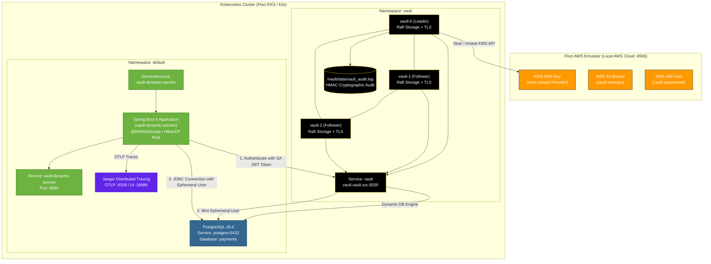

# Production HashiCorp Vault HA, Dynamic Database Secrets, Secret-Less Kubernetes Auth & Distributed Tracing on Floci EKS

This guide is an end-to-end, production-grade runbook for deploying a highly secure, observable, zero-downtime microservices stack on **Kubernetes (Floci EKS emulator)**:
- **HashiCorp Vault HA**: 3-Node Raft Cluster with AWS KMS Auto-Unseal & File Audit Logging.
- **Secret-Less Kubernetes Authentication**: Pods authenticate to Vault using native Kubernetes ServiceAccount JWT tokens (zero static secrets at rest).
- **PostgreSQL 18.4 Dynamic Secrets**: Ephemeral database users minted on demand and hot-swapped inside the JVM via Spring Cloud Vault.
- **Observability & Traceability**: OpenTelemetry distributed tracing exported to **Jaeger** and Prometheus metrics via Spring Boot Actuator.

---

## 1. Complete Architecture Diagram



---

## 2. Step-by-Step Production Setup

### Step 1: Create the EKS Cluster Role
EKS needs an IAM role to manage resources on your behalf.

2.1 Create a trust policy (save as `cluster-trust-policy.json`):
```json
{
  "Version": "2012-10-17",
  "Statement": [
    {
      "Effect": "Allow",
      "Principal": {
        "Service": "eks.amazonaws.com"
      },
      "Action": "sts:AssumeRole"
    }
  ]
}
```
2.2 Create the role and attach the required AWS managed policy:

```bash

export AWS_ENDPOINT_URL=http://localhost:4566
export AWS_DEFAULT_REGION=us-east-1
export AWS_ACCESS_KEY_ID=test
export AWS_SECRET_ACCESS_KEY=test


aws iam create-role \
  --role-name EKSClusterRole \
  --assume-role-policy-document file://cluster-trust-policy.json

aws iam attach-role-policy \
  --role-name EKSClusterRole \
  --policy-arn arn:aws:iam::aws:policy/AmazonEKSClusterPolicy
```


### Step 2: Create the EKS Cluster
Replace the subnet IDs with the subnets from your VPC. This process takes about 10-15 minutes to complete.
```bash
aws eks create-cluster \
  --name vault-cluster \
  --region us-east-1 \
  --role-arn arn:aws:iam::YOUR_ACCOUNT_ID:role/EKSClusterRole \
  --resources-vpc-config subnetIds=subnet-12345,subnet-67890
```
Wait for the cluster status to become ACTIVE before proceeding. You can check the status with:

```bash
aws eks describe-cluster --name vault-cluster --query "cluster.status"
```

### Step 3: Create the Node Group
The EC2 instances (nodes) running your containers also need an IAM role.
3.1 Create the node trust policy (save as `node-trust-policy.json`):

```json
{
  "Version": "2012-10-17",
  "Statement": [
    {
      "Effect": "Allow",
      "Principal": {
        "Service": "ec2.amazonaws.com"
      },
      "Action": "sts:AssumeRole"
    }
  ]
}
```

3.2 Create the role and attach the necessary node policies:

```bash
aws iam create-role \
  --role-name EKSNodeRole \
  --assume-role-policy-document file://node-trust-policy.json

aws iam attach-role-policy \
  --role-name EKSNodeRole \
  --policy-arn arn:aws:iam::aws:policy/AmazonEKSWorkerNodePolicy

aws iam attach-role-policy \
  --role-name EKSNodeRole \
  --policy-arn arn:aws:iam::aws:policy/AmazonEC2ContainerRegistryReadOnly

aws iam attach-role-policy \
  --role-name EKSNodeRole \
  --policy-arn arn:aws:iam::aws:policy/AmazonEKS_CNI_Policy
```

3.3 Create the managed node group:

```bash
aws eks create-nodegroup \
  --cluster-name vault-cluster \
  --nodegroup-name standard-workers \
  --node-role arn:aws:iam::YOUR_ACCOUNT_ID:role/EKSNodeRole \
  --subnets subnet-12345 subnet-67890 \
  --instance-types t3.medium \
  --scaling-config minSize=1,maxSize=4,desiredSize=3
```

### Step 4: Register the OIDC Provider for the Cluster
To map AWS IAM roles to Kubernetes service accounts (IRSA), you must register the cluster's OIDC issuer with AWS IAM.
4.1 Get the OIDC Issuer URL:

```bash
aws eks describe-cluster \
  --name vault-cluster \
  --query "cluster.identity.oidc.issuer" \
  --output text
```

(Example output: [https://oidc.eks.us-east-1.amazonaws.com/id/EXAMPLED539D4633E53E51EXAMPLE](https://oidc.eks.us-east-1.amazonaws.com/id/EXAMPLED539D4633E53E51EXAMPLE))
4.2 Create the IAM OIDC Provider:
(Note: 9e99a48a9960b14926bb7f3b02e22da2b0ab7280 is the standard AWS root CA thumbprint for EKS OIDC).

```bash
aws iam create-open-id-connect-provider \
  --url <YOUR_OIDC_ISSUER_URL> \
  --client-id-list "sts.amazonaws.com" \
  --thumbprint-list "9e99a48a9960b14926bb7f3b02e22da2b0ab7280"
```

### Step 5: Create the Vault IAM Role (IRSA)
Now, create the role that Vault will actually use.
5.1 Create the Vault IAM Policy (save as vault-policy.json):

```json
{
  "Version": "2012-10-17",
  "Statement": [
    {
      "Effect": "Allow",
      "Action": [
        "kms:Encrypt",
        "kms:Decrypt",
        "kms:DescribeKey"
      ],
      "Resource": "arn:aws:kms:us-east-1:YOUR_ACCOUNT_ID:key/YOUR_KMS_KEY_ID"
    }
  ]
}
```

```bash
aws iam create-policy \
  --policy-name VaultKMSUnsealPolicy \
  --policy-document file://vault-policy.json
```

5.2 Create the IRSA Trust Policy (save as vault-irsa-trust.json).
You must replace the OIDC_ID (the string of numbers/letters at the end of your issuer URL) and YOUR_ACCOUNT_ID.

```json
{
  "Version": "2012-10-17",
  "Statement": [
    {
      "Effect": "Allow",
      "Principal": {
        "Federated": "arn:aws:iam::YOUR_ACCOUNT_ID:oidc-provider/oidc.eks.us-east-1.amazonaws.com/id/YOUR_OIDC_ID"
      },
      "Action": "sts:AssumeRoleWithWebIdentity",
      "Condition": {
        "StringEquals": {
          "oidc.eks.us-east-1.amazonaws.com/id/YOUR_OIDC_ID:aud": "sts.amazonaws.com",
          "oidc.eks.us-east-1.amazonaws.com/id/YOUR_OIDC_ID:sub": "system:serviceaccount:vault:vault"
        }
      }
    }
  ]
}
```

5.3 Create the role and attach the policy:
'''bash
aws iam create-role \
  --role-name VaultEksRole \
  --assume-role-policy-document file://vault-irsa-trust.json

aws iam attach-role-policy \
  --role-name VaultEksRole \
  --policy-arn arn:aws:iam::YOUR_ACCOUNT_ID:policy/VaultKMSUnsealPolicy
```

### Step 6: Link the AWS Role to Kubernetes
Finally, update your local kubeconfig and create the Kubernetes Service Account annotated with your new AWS role.

```bash
# Update local kubeconfig
aws eks update-kubeconfig --region us-east-1 --name vault-cluster

# Create the namespace
kubectl create namespace vault

# Create the service account with the AWS IAM role annotation
kubectl apply -f - <<EOF
apiVersion: v1
kind: ServiceAccount
metadata:
  name: vault
  namespace: vault
  annotations:
    eks.amazonaws.com/role-arn: arn:aws:iam::YOUR_ACCOUNT_ID:role/VaultEksRole
EOF
```


### Step 7: Floci AWS Emulator & KMS Auto-Unseal Key
Ensure Floci is running locally (`http://localhost:4566`):
```bash
# 1. Create KMS Key for Vault Auto-Unseal
KMS_KEY_ID=$(aws --endpoint-url=http://localhost:4566 kms create-key \
  --description "Vault Auto-Unseal Key" \
  --query "KeyMetadata.KeyId" --output text)

# 2. Create S3 Bucket for Raft Backups
aws --endpoint-url=http://localhost:4566 s3 mb s3://vault-backups
```

---

### Step 8: Deploy HashiCorp Vault 3-Node Raft HA Cluster
1. **Generate Custom CA & Server TLS Certificates**:
   ```bash
   # Create TLS certificates with SANs for internal cluster communication
   openssl req -x509 -newkey rsa:4096 -days 365 -nodes \
     -keyout tls/ca.key -out tls/ca.crt -subj "/CN=Vault-Internal-CA"

   openssl req -newkey rsa:2048 -nodes \
     -keyout tls/vault.key -out tls/vault.csr \
     -subj "/CN=vault.vault.svc.cluster.local"

   openssl x509 -req -in tls/vault.csr -CA tls/ca.crt -CAkey tls/ca.key \
     -CAcreateserial -out tls/vault.crt -days 365 \
     -extfile <(printf "subjectAltName=DNS:vault,DNS:vault.vault,DNS:vault.vault.svc.cluster.local,DNS:*.vault-internal,IP:127.0.0.1")

   # Create Kubernetes secret
   kubectl create namespace vault
   kubectl create secret generic vault-tls -n vault \
     --from-file=ca.crt=tls/ca.crt \
     --from-file=vault.crt=tls/vault.crt \
     --from-file=vault.key=tls/vault.key
   ```

2. **Deploy Vault Helm Chart with Auto-Unseal**:
   ```bash
   helm repo add hashicorp https://helm.releases.hashicorp.com
   helm repo update

   helm upgrade --install vault hashicorp/vault \
     --namespace vault \
     -f vault-production-floci.yaml
   ```

3. **Initialize Vault (First Time Only)**:
   ```bash
   kubectl exec -n vault vault-0 -- vault operator init \
     -ca-cert=/vault/userconfig/vault-tls/ca.crt \
     -key-shares=1 -key-threshold=1 -format=json > vault-init.json

   ROOT_TOKEN=$(jq -r '.root_token' vault-init.json)
   ```

---

### Step 3: Deploy PostgreSQL 18.4
Deploy PostgreSQL 18.4 in the `default` namespace:
```bash
kubectl apply -f postgres-deployment.yaml

# Wait for PostgreSQL to be ready and initialize the payments schema
kubectl exec -i deployment/postgres -n default -- psql -U postgres -d payments < scripts/schema.sql
```

---

### Step 4: Deploy Jaeger Distributed Tracing
Deploy Jaeger All-In-One to collect and visualize OpenTelemetry traces:
```bash
kubectl apply -f k8s/jaeger-deployment.yaml
```

---

### Step 5: Configure Vault with Secret-Less Kubernetes Auth & Dynamic DB Engine
Run the automated configuration script:
```bash
./scripts/k8s-vault-setup.sh
```

What this script automates:
1. **Enables Audit Logging**: Cryptographic logging to `/vault/data/vault_audit.log`.
2. **Configures Database Engine**: Connects `database/config/payments` to `postgres.default.svc.cluster.local:5432/payments`.
3. **Creates Dynamic DB Role**: `payments-app` with 1m default / 2m max TTL.
4. **Enables Kubernetes Auth (`auth/kubernetes`)**: Points to `https://kubernetes.default.svc:443`.
5. **Binds ServiceAccount**: Maps ServiceAccount `vault-dynamic-secrets` in namespace `default` to policy `payments-app-policy`.

---

### Step 6: Create Java TLS Truststore & Deploy Application
1. **Generate JKS Truststore for Spring Boot**:
   ```bash
   keytool -import -trustcacerts -noprompt -alias vault-ca \
     -file tls/ca.crt -keystore tls/vault-truststore.jks -storepass changeit

   kubectl create secret generic vault-truststore \
     --from-file=vault-truststore.jks=tls/vault-truststore.jks -n default
   ```

2. **Build and Load Docker Image into Cluster**:
   ```bash
   mvn clean package -DskipTests
   docker build -t vault-dynamic-secrets:latest .
   docker save vault-dynamic-secrets:latest | docker exec -i floci-eks-vault-floci ctr -n k8s.io images import -
   ```

3. **Apply Kubernetes Deployment**:
   ```bash
   kubectl apply -f k8s/deployment.yaml
   ```

---

## 3. Secret-Less Kubernetes Authentication vs. AppRole

| Feature | Kubernetes Native Auth *(Active)* | AppRole Auth *(Fallback)* |
|---|---|---|
| **Credential Type** | Pod's projected ServiceAccount token (`/var/run/secrets/...`) | Static `role_id` and `secret_id` |
| **Secret Storage at Rest** | **Zero stored secret**: Token is short-lived and auto-rotated by Kubernetes. | `secret_id` stored in Kubernetes `Secret` object. |
| **Revocation on Pod Delete** | Instant: Token becomes invalid as soon as pod is terminated. | Requires explicit lease revocation. |
| **Configuration** | `spring.cloud.vault.authentication=KUBERNETES` | `spring.cloud.vault.authentication=APPROLE` |

---

## 4. Production TTL Tuning vs. Demo TTL Tuning

To change from Demo TTL (1m/2m) to Production TTL (1h/24h):

### Demo Profile (Default):
- `default_ttl`: `1m`, `max_ttl`: `2m`
- `min-renewal`: `30s`, `expiry-threshold`: `10s`
- `spring.datasource.hikari.max-lifetime`: `90s`

### Production Profile (`SPRING_PROFILES_ACTIVE=prod`):
- `default_ttl`: `1h`, `max_ttl`: `24h`
- `min-renewal`: `15m`, `expiry-threshold`: `5m`
- `spring.datasource.hikari.max-lifetime`: `45m` (`2700000ms`)
- `spring.datasource.hikari.maximum-pool-size`: `50`

To activate production settings in Kubernetes, set `SPRING_PROFILES_ACTIVE: "prod"` in `vault-dynamic-secrets-config` ConfigMap.

---

## 5. Observability, Telemetry & Tracing Runbook

### 1. View Live Dynamic Credential Telemetry (`/actuator/vaultLease`):
```bash
kubectl port-forward svc/vault-dynamic-secrets 8080:8080 -n default &
curl -s http://localhost:8080/actuator/vaultLease | jq .
```
Output:
```json
{
  "activeDatabaseUser": "v-kubernet-payments-yhjMjurqBDjvLG1pC1C8-1786809984",
  "role": "payments-app",
  "rotationStrategy": "refresh-scope",
  "lastRotationTime": "2026-08-15T16:06:24.919Z",
  "backend": "database",
  "rotationCount": 1,
  "status": "ACTIVE"
}
```

### 2. View Distributed Tracing in Jaeger UI:
```bash
kubectl port-forward svc/jaeger 16686:16686 -n default &
```
Open **`http://localhost:16686`** in your browser to inspect end-to-end trace spans for HTTP controllers, Spring Data JPA repositories, and JDBC executions with latency metrics.

### 3. View Real-Time Dynamic Rotation Logs:
```bash
kubectl logs -l app=vault-dynamic-secrets -n default -f
```
Observe the automated heartbeat detecting and logging rotations:
```text
INFO [vault-dynamic-secrets,traceId,spanId] : ⚡ [DB HEARTBEAT] Active PostgreSQL User: v-kubernet-payments-x95uvo1nWjKRLvIPXLjU-1786809884
INFO [vault-dynamic-secrets,traceId,spanId] : ⚠️ [VAULT LEASE EXPIRED] Lease expired! Triggering @RefreshScope Context Refresh...
INFO [vault-dynamic-secrets,traceId,spanId] : 🔄 [DATASOURCE REBUILT] >>> Active Database User: v-kubernet-payments-yhjMjurqBDjvLG1pC1C8-1786809984
INFO [vault-dynamic-secrets,traceId,spanId] : 🔄 [VAULT DYNAMIC CREDS ROTATION DETECTED] >>> Previous User: v-kubernet-... -> NEW Active User: v-kubernet-... <<<
```

### 4. Inspect Vault Audit Log:
```bash
kubectl exec -n vault vault-0 -- tail -f /vault/data/vault_audit.log
```
Every token login, dynamic secret lease issuance, and revocation is recorded with cryptographic HMAC hashing.
