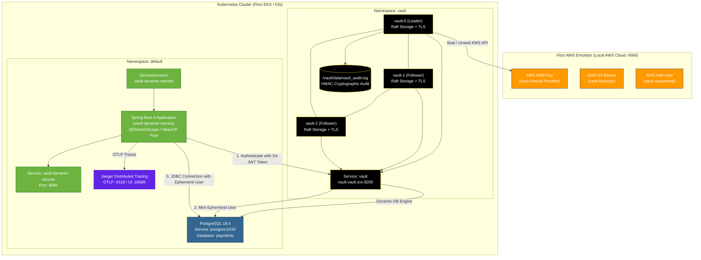

# Production HashiCorp Vault HA, Dynamic Database Secrets, Secret-Less Kubernetes Auth & Distributed Tracing on Floci EKS

This guide is an end-to-end, production-grade runbook for deploying a highly secure, observable, zero-downtime microservices stack on **Kubernetes (Floci EKS emulator)**:
- **HashiCorp Vault HA**: 3-Node Raft Cluster with AWS KMS Auto-Unseal & File Audit Logging.
- **Secret-Less Kubernetes Authentication**: Pods authenticate to Vault using native Kubernetes ServiceAccount JWT tokens (zero static secrets at rest).
- **PostgreSQL 18.4 Dynamic Secrets**: Ephemeral database users minted on demand and hot-swapped inside the JVM via Spring Cloud Vault.
- **Observability & Traceability**: OpenTelemetry distributed tracing exported to **Jaeger** and Prometheus metrics via Spring Boot Actuator.

---

## 1. Complete Architecture Diagram



---

## 2. Prerequisites

- Docker Desktop running with at least 8 GB of memory allocated
- CLI utilities: `aws`, `kubectl`, `helm`, `jq`, `openssl`, `keytool` (JDK 21+), `mvn`

```bash
brew install awscli kubectl helm jq openssl
```

---

## 3. Infrastructure Setup: Floci EKS & Vault HA 3-Node Cluster

### Step 1: Start Floci AWS Emulator

Create or verify `docker-compose-floci.yml`:

```yaml
services:
  floci:
    image: floci/floci@sha256:b3b3a70a294b8ba8095385b8571ea1e4d44d494950d98de5e812cd9de02f506b
    ports:
      - "4566:4566"
    environment:
      AWS_DEFAULT_REGION: us-east-1
      AWS_ACCESS_KEY_ID: test
      AWS_SECRET_ACCESS_KEY: test
      SERVICES: eks,kms,s3,iam
    volumes:
      - floci-data:/app/data
      - /var/run/docker.sock:/var/run/docker.sock
    networks:
      - vault-network

networks:
  vault-network:
    driver: bridge

volumes:
  floci-data:
```

Start the container and wait until healthy:

```bash
docker compose -f docker-compose-floci.yml up -d

until curl --fail --silent http://localhost:4566/health >/dev/null; do
  echo "Waiting for Floci..."
  sleep 2
done
```

> **Note on Docker Socket:** `/var/run/docker.sock` is required by Floci to start and manage the local k3s container for the EKS service.

---

### Step 2: Configure AWS CLI for Floci

Export emulator credentials into your shell:

```bash
export AWS_REGION=us-east-1
export AWS_DEFAULT_REGION="$AWS_REGION"
export AWS_ENDPOINT_URL=http://localhost:4566
export AWS_ACCESS_KEY_ID=test
export AWS_SECRET_ACCESS_KEY=test

aws sts get-caller-identity
aws eks list-clusters
```

---

### Step 3: Create the Floci EKS Cluster

Floci starts a local k3s container when you create an EKS cluster:

```bash
export EKS_CLUSTER_NAME=vault-floci

aws eks create-cluster \
  --name "$EKS_CLUSTER_NAME" \
  --role-arn arn:aws:iam::000000000000:role/eks-role \
  --resources-vpc-config 'subnetIds=[],securityGroupIds=[]' \
  --kubernetes-version 1.29

aws eks wait cluster-active \
  --name "$EKS_CLUSTER_NAME" \
  --region "$AWS_REGION"

aws eks update-kubeconfig \
  --name "$EKS_CLUSTER_NAME" \
  --region "$AWS_REGION"

kubectl config current-context
kubectl get nodes -o wide
```

Expected result: one Ready k3s control-plane node.

---

### Step 4: Create the Namespace and TLS Secrets

Vault's Helm values mount two Secrets named `tls-ca` and `tls-server`. Create the `vault` namespace and secrets before deploying Vault:

```bash
kubectl create namespace vault --dry-run=client -o yaml | kubectl apply -f -

# Generate CA and server certificates if not already generated in tls/
mkdir -p tls
if [ ! -f tls/ca.crt ] || [ ! -f tls/vault.crt ]; then
  openssl req -x509 -newkey rsa:4096 -days 365 -nodes \
    -keyout tls/ca.key -out tls/ca.crt -subj "/CN=Vault-Internal-CA"

  openssl req -newkey rsa:2048 -nodes \
    -keyout tls/vault.key -out tls/vault.csr \
    -subj "/CN=vault.vault.svc.cluster.local"

  openssl x509 -req -in tls/vault.csr -CA tls/ca.crt -CAkey tls/ca.key \
    -CAcreateserial -out tls/vault.crt -days 365 \
    -extfile <(printf "subjectAltName=DNS:vault,DNS:vault.vault,DNS:vault.vault.svc,DNS:vault.vault.svc.cluster.local,DNS:*.vault-internal,IP:127.0.0.1")
fi

kubectl create secret generic tls-ca \
  --from-file=ca.crt=tls/ca.crt \
  --namespace vault \
  --dry-run=client -o yaml | kubectl apply -f -

kubectl create secret tls tls-server \
  --cert=tls/vault.crt \
  --key=tls/vault.key \
  --namespace vault \
  --dry-run=client -o yaml | kubectl apply -f -

kubectl get secrets -n vault tls-ca tls-server
```

---

### Step 5: Create Floci KMS, S3, and IAM Resources

```bash
KMS_KEY=$(aws kms create-key \
  --description "Vault auto-unseal key (Floci)" \
  --query 'KeyMetadata.KeyId' \
  --output text)

aws kms create-alias \
  --alias-name alias/vault-autounseal \
  --target-key-id "$KMS_KEY"

aws s3 mb s3://vault-backups
aws s3api put-bucket-versioning \
  --bucket vault-backups \
  --versioning-configuration Status=Enabled

printf '%s\n' "$KMS_KEY" > kms-key-id.txt

aws iam create-user --user-name vault-autounseal

aws iam put-user-policy \
  --user-name vault-autounseal \
  --policy-name vault-autounseal-policy \
  --policy-document '{
    "Version": "2012-10-17",
    "Statement": [
      {
        "Effect": "Allow",
        "Action": ["kms:Decrypt", "kms:Encrypt", "kms:GenerateDataKey", "kms:DescribeKey"],
        "Resource": "*"
      },
      {
        "Effect": "Allow",
        "Action": ["s3:GetObject", "s3:PutObject", "s3:ListBucket"],
        "Resource": ["arn:aws:s3:::vault-backups", "arn:aws:s3:::vault-backups/*"]
      }
    ]
  }'

aws iam create-access-key --user-name vault-autounseal > vault-iam.json

export FLOCI_ACCESS_KEY=$(jq -r '.AccessKey.AccessKeyId' vault-iam.json)
export FLOCI_SECRET_KEY=$(jq -r '.AccessKey.SecretAccessKey' vault-iam.json)

: "${FLOCI_ACCESS_KEY:?FLOCI_ACCESS_KEY is empty}"
: "${FLOCI_SECRET_KEY:?FLOCI_SECRET_KEY is empty}"

cat > floci-credentials.env <<EOF
export FLOCI_ACCESS_KEY=$FLOCI_ACCESS_KEY
export FLOCI_SECRET_KEY=$FLOCI_SECRET_KEY
export FLOCI_KMS_KEY=$KMS_KEY
EOF
chmod 600 floci-credentials.env vault-iam.json
```

---

### Step 6: Create the Vault Credentials Secret

Vault retrieves its AWS credentials from the `floci-credentials` Kubernetes Secret:

```bash
source floci-credentials.env

kubectl create secret generic floci-credentials \
  --from-literal=access-key="$FLOCI_ACCESS_KEY" \
  --from-literal=secret-key="$FLOCI_SECRET_KEY" \
  --namespace vault \
  --dry-run=client -o yaml | kubectl apply -f -

kubectl describe secret floci-credentials -n vault
```

Confirm `access-key` and `secret-key` report non-zero sizes (20 bytes and 40 bytes).

---

### Step 7: Configure the Vault Helm Values File

The repository includes `vault-production-floci.yaml` (also available at `k8s/vault-production-floci.yaml`). If you need to create it from scratch in your current directory:

```yaml
cat <<'EOF' > vault-production-floci.yaml
global:
  enabled: true
  tlsDisable: false

serviceName: vault-internal

server:
  image:
    repository: hashicorp/vault
    tag: "1.18.2"
    pullPolicy: IfNotPresent

  resources:
    requests:
      cpu: 250m
      memory: 512Mi
    limits:
      cpu: 1000m
      memory: 1Gi

  dataStorage:
    enabled: true
    size: 256Mi
    storageClass: ""

  auditStorage:
    enabled: true
    size: 128Mi
    storageClass: ""

  standalone:
    enabled: false

  ha:
    enabled: true
    replicas: 3
    raft:
      enabled: true
      setNodeId: true

      config: |
        ui = true
        cluster_name = "vault-kubernetes-production-floci"

        listener "tcp" {
          address            = "[::]:8200"
          cluster_address    = "[::]:8201"
          tls_cert_file      = "/vault/userconfig/tls-server/tls.crt"
          tls_key_file       = "/vault/userconfig/tls-server/tls.key"
          tls_client_ca_file = "/vault/userconfig/tls-ca/ca.crt"
        }

        storage "raft" {
          path = "/vault/data"
          retain_logs = 7
          snapshot_threshold = 16384
          trailing_logs = 0

          retry_join {
            leader_api_addr = "https://vault-0.vault-internal:8200"
            leader_ca_cert_file = "/vault/userconfig/tls-ca/ca.crt"
            leader_client_cert_file = "/vault/userconfig/tls-server/tls.crt"
            leader_client_key_file = "/vault/userconfig/tls-server/tls.key"
          }
          retry_join {
            leader_api_addr = "https://vault-1.vault-internal:8200"
            leader_ca_cert_file = "/vault/userconfig/tls-ca/ca.crt"
            leader_client_cert_file = "/vault/userconfig/tls-server/tls.crt"
            leader_client_key_file = "/vault/userconfig/tls-server/tls.key"
          }
          retry_join {
            leader_api_addr = "https://vault-2.vault-internal:8200"
            leader_ca_cert_file = "/vault/userconfig/tls-ca/ca.crt"
            leader_client_cert_file = "/vault/userconfig/tls-server/tls.crt"
            leader_client_key_file = "/vault/userconfig/tls-server/tls.key"
          }
        }

        # ============================================================
        # AUTO-UNSEAL via FLOCI KMS
        # ============================================================
        seal "awskms" {
          region     = "us-east-1"
          kms_key_id = "FLOCI_KMS_KEY_PLACEHOLDER"
          endpoint   = "http://127.0.0.1:4566"
          skip_region_validation = true
        }

        service_registration "kubernetes" {}

  extraEnvironmentVars:
    VAULT_CACERT: /vault/userconfig/tls-ca/ca.crt
    AWS_REGION: us-east-1
    AWS_ENDPOINT_URL: http://127.0.0.1:4566
    AWS_DEFAULT_REGION: us-east-1

  extraSecretEnvironmentVars:
    - envName: AWS_ACCESS_KEY_ID
      secretName: floci-credentials
      secretKey: access-key
    - envName: AWS_SECRET_ACCESS_KEY
      secretName: floci-credentials
      secretKey: secret-key

  extraVolumes:
    - type: secret
      name: tls-server
    - type: secret
      name: tls-ca

  readinessProbe:
    enabled: true
    path: "/v1/sys/health?standbyok=true&sealedcode=503&uninitcode=501"
    initialDelaySeconds: 10
    periodSeconds: 5
    timeoutSeconds: 3
    failureThreshold: 3

  livenessProbe:
    enabled: false

  audit:
    file:
      enabled: true

  affinity: ""

ui:
  enabled: true
  serviceType: ClusterIP
  externalPort: 8200

injector:
  enabled: true
  replicas: 1
  resources:
    requests:
      cpu: 100m
      memory: 128Mi
    limits:
      cpu: 500m
      memory: 512Mi
EOF
```

In Docker on macOS, pods inside the k3s cluster reach Floci directly via its Docker bridge network IP:

```bash
source floci-credentials.env

# Automatically obtain Floci container IP on Docker network
FLOCI_CONTAINER_IP=$(docker inspect -f '{{range .NetworkSettings.Networks}}{{.IPAddress}}{{end}}' floci)
export FLOCI_POD_ENDPOINT="http://${FLOCI_CONTAINER_IP}:4566"

echo "Using Floci Pod Endpoint: $FLOCI_POD_ENDPOINT"
echo "Using Floci KMS Key: $FLOCI_KMS_KEY"

sed -i.bak -E \
  "s|kms_key_id = \"[^\"]*\"|kms_key_id = \"$FLOCI_KMS_KEY\"|" \
  vault-production-floci.yaml

sed -i.bak \
  "s|AWS_ENDPOINT_URL: .*|AWS_ENDPOINT_URL: $FLOCI_POD_ENDPOINT|" \
  vault-production-floci.yaml

sed -i.bak -E \
  "s|endpoint[[:space:]]*=[[:space:]]*\"[^\"]*\"|endpoint   = \"$FLOCI_POD_ENDPOINT\"|" \
  vault-production-floci.yaml

helm template vault hashicorp/vault \
  --version 0.34.1 \
  --namespace vault \
  -f vault-production-floci.yaml >/dev/null
```

---

### Step 8: Deploy Vault 3-Node Raft HA Cluster

```bash
helm repo add hashicorp https://helm.releases.hashicorp.com
helm repo update

helm upgrade --install vault hashicorp/vault \
  --namespace vault \
  --create-namespace \
  --version 0.34.1 \
  -f vault-production-floci.yaml

kubectl get pods -n vault
```

Wait until all 3 pods (`vault-0`, `vault-1`, `vault-2`) enter the `Running` state:

```bash
kubectl wait --for=condition=ContainersReady=false pod/vault-0 -n vault --timeout=60s
```

---

### Step 9: Initialize and Verify Vault HA Cluster

Auto-unseal handles unsealing automatically; Vault only needs to be initialized once:

```bash
kubectl exec vault-0 -n vault -- vault status

# Run initialization and save recovery keys and initial root token
kubectl exec vault-0 -n vault -- \
  vault operator init -format=json > vault-init.json
chmod 600 vault-init.json

# Wait for Raft HA synchronization and KMS auto-unseal
sleep 5

# Check status (should show Initialized: true, Sealed: false, HA Mode: active)
kubectl exec vault-0 -n vault -- vault status

# Verify Raft peers (requires root token)
ROOT_TOKEN=$(jq -r '.root_token' vault-init.json)
kubectl exec vault-0 -n vault -- env VAULT_TOKEN="$ROOT_TOKEN" vault operator raft list-peers

# All pods should now show 1/1 Running
kubectl get pods -n vault
```

Expected Raft peers output:
```
Node       Address                        State       Voter
----       -------                        -----       -----
vault-0    vault-0.vault-internal:8201    leader      true
vault-1    vault-1.vault-internal:8201    follower    true
vault-2    vault-2.vault-internal:8201    follower    true
```

---

### Step 10: Test Secret Operations and HA Failover

```bash
ROOT_TOKEN=$(jq -r '.root_token' vault-init.json)

# Enable KV v2 secrets engine
kubectl exec vault-0 -n vault -- env VAULT_TOKEN="$ROOT_TOKEN" vault secrets enable -path=secret kv-v2

# Write a test secret to active leader (vault-0)
kubectl exec vault-0 -n vault -- env VAULT_TOKEN="$ROOT_TOKEN" vault kv put secret/app config="production-floci" db="postgres"

# Read back from standby follower (vault-1)
kubectl exec vault-1 -n vault -- env VAULT_TOKEN="$ROOT_TOKEN" vault kv get secret/app

# Test auto-unseal by restarting a follower pod
kubectl delete pod vault-1 -n vault
kubectl wait --for=condition=Ready pod/vault-1 -n vault --timeout=60s
kubectl exec vault-1 -n vault -- vault status
```

---

### Step 11: Access the Vault UI

```bash
kubectl port-forward --namespace vault service/vault-ui 8200:8200
```

Open `https://localhost:8200` in your browser, accept the local TLS certificate, and log in with the `root_token` from `vault-init.json`.

---

## 4. Application & Dynamic Secrets Setup: PostgreSQL, Jaeger & Spring Boot

### Step 12: Deploy PostgreSQL 18.4

Deploy PostgreSQL 18.4 in the `default` namespace:

```bash
kubectl apply -f postgres-deployment.yaml

# Wait for PostgreSQL to be ready and initialize the payments schema
kubectl wait --for=condition=Ready pod -l app=postgres -n default --timeout=60s
kubectl exec -i deployment/postgres -n default -- psql -U postgres -d payments < scripts/schema.sql
```

---

### Step 13: Deploy Jaeger Distributed Tracing

Deploy Jaeger All-In-One to collect and visualize OpenTelemetry traces:

```bash
kubectl apply -f k8s/jaeger-deployment.yaml
kubectl wait --for=condition=Ready pod -l app=jaeger -n default --timeout=60s
```

---

### Step 14: Configure Vault Secret-Less Kubernetes Auth & Dynamic DB Engine

Run the automated configuration script:

```bash
export VAULT_TOKEN=$(jq -r '.root_token' vault-init.json)
./scripts/k8s-vault-setup.sh
```

What this script automates:
1. **Enables Audit Logging**: Cryptographic HMAC logging to `/vault/data/vault_audit.log`.
2. **Configures Database Engine**: Connects `database/config/payments` to `postgres.default.svc.cluster.local:5432/payments`.
3. **Creates Dynamic DB Roles**:
   - `payments-app`: Demo role (1m default / 2m max TTL).
   - `payments-app-prod`: Production role (1h default / 24h max TTL).
4. **Enables Kubernetes Auth (`auth/kubernetes`)**: Points to `https://kubernetes.default.svc:443`.
5. **Binds ServiceAccount**: Maps ServiceAccount `vault-dynamic-secrets` in namespace `default` to policy `payments-app-policy`.
6. **Configures AppRole Auth**: Role ID & Secret ID as backup authentication mechanism.

---

### Step 15: Create Java TLS Truststore & Deploy Application

1. **Generate JKS Truststore for Spring Boot**:
   ```bash
   keytool -import -trustcacerts -noprompt -alias vault-ca \
     -file tls/ca.crt -keystore tls/vault-truststore.jks -storepass changeit

   kubectl create secret generic vault-truststore \
     --from-file=vault-truststore.jks=tls/vault-truststore.jks \
     -n default \
     --dry-run=client -o yaml | kubectl apply -f -
   ```

2. **Build and Load Docker Image into Cluster**:
   ```bash
   mvn clean package -DskipTests
   docker build -t vault-dynamic-secrets:latest .
   docker save vault-dynamic-secrets:latest | docker exec -i floci-eks-vault-floci ctr -n k8s.io images import -
   ```

3. **Apply Kubernetes Deployment**:
   ```bash
   kubectl apply -f k8s/deployment.yaml
   kubectl rollout status deployment/vault-dynamic-secrets -n default --timeout=90s
   ```

---

## 5. Secret-Less Kubernetes Authentication vs. AppRole

| Feature | Kubernetes Native Auth *(Active)* | AppRole Auth *(Fallback)* |
|---|---|---|
| **Credential Type** | Pod's projected ServiceAccount token (`/var/run/secrets/...`) | Static `role_id` and `secret_id` |
| **Secret Storage at Rest** | **Zero stored secret**: Token is short-lived and auto-rotated by Kubernetes. | `secret_id` stored in Kubernetes `Secret` object. |
| **Revocation on Pod Delete** | Instant: Token becomes invalid as soon as pod is terminated. | Requires explicit lease revocation. |
| **Configuration** | `spring.cloud.vault.authentication=KUBERNETES` | `spring.cloud.vault.authentication=APPROLE` |

---

## 6. Production TTL Tuning vs. Demo TTL Tuning

To change from Demo TTL (1m/2m) to Production TTL (1h/24h):

### Demo Profile (Default):
- `default_ttl`: `1m`, `max_ttl`: `2m`
- `min-renewal`: `30s`, `expiry-threshold`: `10s`
- `spring.datasource.hikari.max-lifetime`: `90s`

### Production Profile (`SPRING_PROFILES_ACTIVE=prod`):
- `default_ttl`: `1h`, `max_ttl`: `24h`
- `min-renewal`: `15m`, `expiry-threshold`: `5m`
- `spring.datasource.hikari.max-lifetime`: `45m` (`2700000ms`)
- `spring.datasource.hikari.maximum-pool-size`: `50`

To activate production settings in Kubernetes, set `SPRING_PROFILES_ACTIVE: "prod"` in `vault-dynamic-secrets-config` ConfigMap.

---

## 7. Observability, Telemetry & Tracing Runbook

### 1. View Live Dynamic Credential Telemetry (`/actuator/vaultLease`):
```bash
kubectl port-forward svc/vault-dynamic-secrets 8080:8080 -n default &
curl -s http://localhost:8080/actuator/vaultLease | jq .
```
Output:
```json
{
  "activeDatabaseUser": "v-kubernet-payments-yhjMjurqBDjvLG1pC1C8-1786809984",
  "role": "payments-app",
  "rotationStrategy": "refresh-scope",
  "lastRotationTime": "2026-08-15T16:06:24.919Z",
  "backend": "database",
  "rotationCount": 1,
  "status": "ACTIVE"
}
```

### 2. View Distributed Tracing in Jaeger UI:
```bash
kubectl port-forward svc/jaeger 16686:16686 -n default &
```
Open **`http://localhost:16686`** in your browser to inspect end-to-end trace spans for HTTP controllers, Spring Data JPA repositories, and JDBC executions with latency metrics.

### 3. View Real-Time Dynamic Rotation Logs:
```bash
kubectl logs -l app=vault-dynamic-secrets -n default -f
```
Observe the automated heartbeat detecting and logging rotations:
```text
INFO [vault-dynamic-secrets,traceId,spanId] : ⚡ [DB HEARTBEAT] Active PostgreSQL User: v-kubernet-payments-x95uvo1nWjKRLvIPXLjU-1786809884
INFO [vault-dynamic-secrets,traceId,spanId] : ⚠️ [VAULT LEASE EXPIRED] Lease expired! Triggering @RefreshScope Context Refresh...
INFO [vault-dynamic-secrets,traceId,spanId] : 🔄 [DATASOURCE REBUILT] >>> Active Database User: v-kubernet-payments-yhjMjurqBDjvLG1pC1C8-1786809984
INFO [vault-dynamic-secrets,traceId,spanId] : 🔄 [VAULT DYNAMIC CREDS ROTATION DETECTED] >>> Previous User: v-kubernet-... -> NEW Active User: v-kubernet-... <<<
```

### 4. Inspect Vault Audit Log:
```bash
kubectl exec -n vault vault-0 -- tail -f /vault/data/vault_audit.log
```
Every token login, dynamic secret lease issuance, and revocation is recorded with cryptographic HMAC hashing.

---

## 8. Troubleshooting

| Symptom | Cause and resolution |
|---|---|
| `dial tcp: lookup host.docker.internal: no such host` | k3s in-cluster CoreDNS does not resolve `host.docker.internal`. Set `FLOCI_POD_ENDPOINT` to the Floci container IP (`docker inspect -f '{{range .NetworkSettings.Networks}}{{.IPAddress}}{{end}}' floci`) as described in step 7. |
| `InvalidClientTokenId` from `aws` | The shell is using real or invalid AWS credentials. Re-export the Floci variables from step 2. |
| `localhost:8080: connect: connection refused` | `kubectl` has no valid context. Re-run `aws eks update-kubeconfig` from step 3. |
| `secret tls-server not found` or `secret tls-ca not found` | Run step 4 before Helm deployment. |
| `NoCredentialProviders` | The `floci-credentials` Secret has empty values or is missing. Repeat steps 5 and 6, then run `kubectl rollout restart statefulset/vault -n vault`. |
| `permission denied` on `vault operator raft list-peers` | Authenticate using the root token: `kubectl exec vault-0 -n vault -- env VAULT_TOKEN="$ROOT_TOKEN" vault operator raft list-peers`. |
| Helm schema error for `extraSecretEnvironmentVars` | Use the supplied values file. It must be a YAML list with `envName`, `secretName`, and `secretKey`. |

---

## 9. Cleanup

```bash
# Application teardown
kubectl delete -f k8s/deployment.yaml -n default --ignore-not-found
kubectl delete -f k8s/jaeger-deployment.yaml -n default --ignore-not-found
kubectl delete -f postgres-deployment.yaml -n default --ignore-not-found

# Vault and Infrastructure teardown
helm uninstall vault -n vault --ignore-not-found
kubectl delete namespace vault --ignore-not-found
aws eks delete-cluster --name "$EKS_CLUSTER_NAME" --region "$AWS_REGION"
docker compose -f docker-compose-floci.yml down
```

---

## 10. References

- [Floci EKS documentation](https://floci.io/floci/services/eks/)
- [HashiCorp Vault Helm chart documentation](https://developer.hashicorp.com/vault/docs/platform/k8s/helm)
- [Vault AWS KMS seal documentation](https://developer.hashicorp.com/vault/docs/configuration/seal/awskms)
- [Vault Raft integrated storage](https://developer.hashicorp.com/vault/docs/configuration/storage/raft)
- [Spring Cloud Vault Documentation](https://cloud.spring.io/spring-cloud-vault/)
