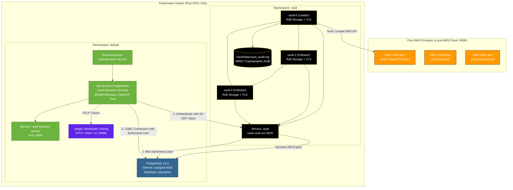

# Production HashiCorp Vault HA, Dynamic Database Secrets, Secret-Less Kubernetes Auth & Distributed Tracing on Floci EKS

This guide is an end-to-end, production-grade runbook for deploying a highly secure, observable, zero-downtime microservices stack on **Kubernetes (Floci EKS emulator)**:
- **HashiCorp Vault HA**: 3-Node Raft Cluster with AWS KMS Auto-Unseal & File Audit Logging.
- **Secret-Less Kubernetes Authentication**: Pods authenticate to Vault using native Kubernetes ServiceAccount JWT tokens (zero static secrets at rest).
- **PostgreSQL 18.4 Dynamic Secrets**: Ephemeral database users minted on demand and hot-swapped inside the JVM via Spring Cloud Vault.
- **Observability & Traceability**: OpenTelemetry distributed tracing exported to **Jaeger** and Prometheus metrics via Spring Boot Actuator.

---

## 1. Complete Architecture Diagram



---

## 2. Prerequisites & Local Tooling

Before initiating the deployment, ensure all required CLI binaries and container runtime dependencies are installed.

```bash
brew install awscli kubectl helm jq openssl
```

### Detailed Command Analysis:

#### `brew install awscli kubectl helm jq openssl`
- **Why we are executing this command**:
  - `awscli`: Required to interact with the local Floci AWS emulator (EKS cluster creation, KMS key management, IAM user/policy provisioning, and S3 bucket creation).
  - `kubectl`: The Kubernetes standard command-line client required to deploy and manage workloads, namespaces, secrets, and inspect cluster status.
  - `helm`: The Kubernetes package manager used to deploy the official HashiCorp Vault 3-node HA Raft cluster chart with custom values.
  - `jq`: Command-line JSON processor required to parse tokens, keys, and endpoints from JSON outputs returned by AWS CLI and Vault init commands.
  - `openssl`: Cryptographic toolkit required to generate a private self-signed Certificate Authority (CA) and TLS certificates with Subject Alternative Names (SANs) for mutual TLS (mTLS) encryption across the Vault cluster.
- **What happens if we don't execute**:
  - Subsequent setup scripts and CLI commands will immediately fail with `command not found: <tool>` (e.g., `command not found: aws` or `command not found: helm`).
- **What is the use of execution / Result**:
  - Installs and links the fundamental toolset into your system path (`/usr/local/bin` or `/opt/homebrew/bin`), enabling automated cluster provisioning, certificate creation, and deployment validation.

---

## 3. Infrastructure Setup: Floci EKS & Vault HA 3-Node Cluster

### Step 1: Start Floci AWS Emulator

Floci provides a drop-in, lightweight local emulator for AWS services including EKS, KMS, S3, and IAM.

Create or verify `docker-compose-floci.yml`:

```yaml
services:
  floci:
    image: floci/floci@sha256:b3b3a70a294b8ba8095385b8571ea1e4d44d494950d98de5e812cd9de02f506b
    ports:
      - "4566:4566"
    environment:
      AWS_DEFAULT_REGION: us-east-1
      AWS_ACCESS_KEY_ID: test
      AWS_SECRET_ACCESS_KEY: test
      SERVICES: eks,kms,s3,iam
    volumes:
      - floci-data:/app/data
      - /var/run/docker.sock:/var/run/docker.sock
    networks:
      - vault-network

networks:
  vault-network:
    driver: bridge

volumes:
  floci-data:
```

Start the container and wait until the health endpoint confirms readiness:

```bash
docker compose -f docker-compose-floci.yml up -d

until curl --fail --silent http://localhost:4566/health >/dev/null; do
  echo "Waiting for Floci..."
  sleep 2
done
```

### Detailed Command Analysis:

#### `docker compose -f docker-compose-floci.yml up -d`
- **Why we are executing this command**:
  - Starts the Floci AWS emulator container in the background (detached mode) on port `4566`, enabling simulated EKS, KMS, S3, and IAM APIs locally without incurring AWS cloud costs.
  - Mounts `/var/run/docker.sock` so Floci can dynamically spawn and manage containerized k3s instances when EKS clusters are created.
- **What happens if we don't execute**:
  - The local AWS mock endpoint `http://localhost:4566` will remain offline. All subsequent `aws` CLI commands, KMS provisioning, and EKS cluster creation will fail with `Connection refused` or `Network is unreachable`.
- **What is the use of execution / Result**:
  - Spawns the running container `floci` connected to the Docker bridge network `vault-network`, exposing port `4566`.

#### `until curl --fail --silent http://localhost:4566/health >/dev/null; do ... sleep 2; done`
- **Why we are executing this command**:
  - Serves as a synchronization barrier. The Floci emulator requires a few seconds after container startup to initialize internal mock daemons (EKS controller, KMS key store, S3 engine).
- **What happens if we don't execute**:
  - Commands executed immediately might hit the port while mock services are still bootstrapping, causing premature API timeouts, `502 Bad Gateway`, or incomplete initializations.
- **What is the use of execution / Result**:
  - Blocks execution cleanly until Floci returns HTTP 200 OK on its health check route, guaranteeing the emulator is ready for incoming API traffic.

---

### Step 2: Configure AWS CLI for Floci

Direct standard AWS CLI commands to the local emulator endpoint:

```bash
export AWS_REGION=us-east-1
export AWS_DEFAULT_REGION="$AWS_REGION"
export AWS_ENDPOINT_URL=http://localhost:4566
export AWS_ACCESS_KEY_ID=test
export AWS_SECRET_ACCESS_KEY=test

aws sts get-caller-identity
aws eks list-clusters
```

### Detailed Command Analysis:

#### `export AWS_REGION=us-east-1` & `export AWS_ENDPOINT_URL=http://localhost:4566` & credentials
- **Why we are executing this command**:
  - Configures environment variables in the current shell session so all `aws` CLI commands redirect their target endpoint from real AWS data centers to `http://localhost:4566` with mock authorization credentials.
- **What happens if we don't execute**:
  - The `aws` CLI will attempt to contact real AWS public endpoints (e.g. `https://eks.us-east-1.amazonaws.com`) and read default cloud credentials from `~/.aws/credentials`, leading to `InvalidClientTokenId`, authentication failures, or unintentional provisioning on real cloud accounts.
- **What is the use of execution / Result**:
  - Ensures seamless local operation where all standard AWS CLI commands target the local Floci container.

#### `aws sts get-caller-identity`
- **Why we are executing this command**:
  - Performs a lightweight connectivity and authentication sanity test against the Floci Security Token Service (STS).
- **What happens if we don't execute**:
  - You proceed blindly without knowing whether your shell environment is correctly pointing to the emulator or whether the emulator is answering STS calls.
- **What is the use of execution / Result**:
  - Returns simulated identity JSON (`"Account": "000000000000"`, `"Arn": "arn:aws:iam::000000000000:root"`), confirming active communication.

#### `aws eks list-clusters`
- **Why we are executing this command**:
  - Verifies that the EKS emulation engine inside Floci is operational and lists any existing clusters to avoid naming collisions.
- **What happens if we don't execute**:
  - If the EKS subsystem failed to start inside Floci, you would not discover it until running a cluster creation command.
- **What is the use of execution / Result**:
  - Returns `{"clusters": []}`, demonstrating that the EKS API is ready to accept cluster provisioning requests.

---

### Step 3: Create the Floci EKS Cluster

Create a local k3s Kubernetes cluster managed by Floci:

```bash
export EKS_CLUSTER_NAME=vault-floci

aws eks create-cluster \
  --name "$EKS_CLUSTER_NAME" \
  --role-arn arn:aws:iam::000000000000:role/eks-role \
  --resources-vpc-config 'subnetIds=[],securityGroupIds=[]' \
  --kubernetes-version 1.29

aws eks wait cluster-active \
  --name "$EKS_CLUSTER_NAME" \
  --region "$AWS_REGION"

aws eks update-kubeconfig \
  --name "$EKS_CLUSTER_NAME" \
  --region "$AWS_REGION"

kubectl config current-context
kubectl get nodes -o wide
```

### Detailed Command Analysis:

#### `export EKS_CLUSTER_NAME=vault-floci`
- **Why we are executing this command**:
  - Defines a standard, reproducible name for the Kubernetes cluster across creation, configuration, status checks, and cleanup steps.
- **What happens if we don't execute**:
  - Script variables will be empty or undefined, resulting in invalid AWS CLI arguments and command failures.
- **What is the use of execution / Result**:
  - Sets the environment variable `$EKS_CLUSTER_NAME` to `vault-floci`.

#### `aws eks create-cluster --name "$EKS_CLUSTER_NAME" ...`
- **Why we are executing this command**:
  - Triggers Floci's EKS engine to provision an emulated EKS cluster. Under the hood, Floci launches a Docker container running a k3s Kubernetes v1.29 control plane.
- **What happens if we don't execute**:
  - No Kubernetes cluster will exist to host Vault, PostgreSQL, Jaeger, or Spring Boot workloads.
- **What is the use of execution / Result**:
  - Floci initiates the creation of the k3s cluster container (e.g. `floci-eks-vault-floci`) and sets cluster status to `CREATING`.

#### `aws eks wait cluster-active --name "$EKS_CLUSTER_NAME" --region "$AWS_REGION"`
- **Why we are executing this command**:
  - Pauses the shell script execution and polls the cluster state until Floci reports status `ACTIVE`, ensuring the k3s API server and etcd/sqlite backing stores are completely ready.
- **What happens if we don't execute**:
  - Attempting to update `kubeconfig` or connect with `kubectl` immediately will fail because the k3s API server is still booting.
- **What is the use of execution / Result**:
  - Guarantees synchronous completion before running dependent Kubernetes commands.

#### `aws eks update-kubeconfig --name "$EKS_CLUSTER_NAME" --region "$AWS_REGION"`
- **Why we are executing this command**:
  - Automatically fetches the k3s cluster endpoint and certificate authority data from Floci, creates a new kubeconfig context, and sets it as the active context in `~/.kube/config`.
- **What happens if we don't execute**:
  - `kubectl` will either point to an old/unrelated cluster (e.g., Docker Desktop, Minikube, or a cloud cluster) or fail with `The connection to the server localhost:8080 was refused`.
- **What is the use of execution / Result**:
  - Points `kubectl` directly to the newly created Floci EKS cluster.

#### `kubectl config current-context` & `kubectl get nodes -o wide`
- **Why we are executing this command**:
  - Verifies that `kubectl` is targeted at `arn:aws:eks:us-east-1:000000000000:cluster/vault-floci` and confirms that the control plane node is in `Ready` status.
- **What happens if we don't execute**:
  - You risk applying security-sensitive Vault manifests to the wrong cluster or deploying pods onto a node that has not completed networking initialization.
- **What is the use of execution / Result**:
  - Confirms the active context and displays one `Ready` k3s node with its internal container IP address.

---

### Step 4: Create the Namespace and TLS Secrets

Vault in High Availability mode uses mutual TLS (mTLS) for secure inter-node Raft consensus and HTTPS client traffic:

```bash
kubectl create namespace vault --dry-run=client -o yaml | kubectl apply -f -

# Generate CA and server certificates if not already generated in tls/
mkdir -p tls
if [ ! -f tls/ca.crt ] || [ ! -f tls/vault.crt ]; then
  openssl req -x509 -newkey rsa:4096 -days 365 -nodes \
    -keyout tls/ca.key -out tls/ca.crt -subj "/CN=Vault-Internal-CA"

  openssl req -newkey rsa:2048 -nodes \
    -keyout tls/vault.key -out tls/vault.csr \
    -subj "/CN=vault.vault.svc.cluster.local"

  openssl x509 -req -in tls/vault.csr -CA tls/ca.crt -CAkey tls/ca.key \
    -CAcreateserial -out tls/vault.crt -days 365 \
    -extfile <(printf "subjectAltName=DNS:vault,DNS:vault.vault,DNS:vault.vault.svc,DNS:vault.vault.svc.cluster.local,DNS:*.vault-internal,IP:127.0.0.1")
fi

kubectl create secret generic tls-ca \
  --from-file=ca.crt=tls/ca.crt \
  --namespace vault \
  --dry-run=client -o yaml | kubectl apply -f -

kubectl create secret tls tls-server \
  --cert=tls/vault.crt \
  --key=tls/vault.key \
  --namespace vault \
  --dry-run=client -o yaml | kubectl apply -f -

kubectl get secrets -n vault tls-ca tls-server
```

### Detailed Command Analysis:

#### `kubectl create namespace vault --dry-run=client -o yaml | kubectl apply -f -`
- **Why we are executing this command**:
  - Creates the dedicated `vault` namespace in an idempotent manner (will not throw errors if the namespace already exists).
- **What happens if we don't execute**:
  - All subsequent secret creation commands and Helm installations targeted at `-n vault` will fail with `namespaces "vault" not found`.
- **What is the use of execution / Result**:
  - Establishes an isolated Kubernetes namespace for Vault cluster components, secrets, and access controls.

#### `openssl req ... (CA and Server Certificate Generation with SANs)`
- **Why we are executing this command**:
  - Creates a dedicated Certificate Authority (`ca.crt`) and signs a server certificate (`vault.crt`) containing Subject Alternative Names (SANs) for all internal Kubernetes DNS hostnames (`vault`, `vault.vault.svc.cluster.local`, `*.vault-internal`, and `127.0.0.1`).
- **What happens if we don't execute**:
  - Without TLS certificates, Vault cannot enable TLS encryption. If certificates lack SANs for internal headless services (`*.vault-internal`), Raft peer-to-peer communication and follower `retry_join` operations will fail with TLS hostname verification errors.
- **What is the use of execution / Result**:
  - Generates `tls/ca.crt`, `tls/ca.key`, `tls/vault.crt`, and `tls/vault.key` ready for mounting into Kubernetes pods.

#### `kubectl create secret generic tls-ca ...` & `kubectl create secret tls tls-server ...`
- **Why we are executing this command**:
  - Creates the Kubernetes Secret objects `tls-ca` and `tls-server` in the `vault` namespace so the Vault StatefulSet can mount the certificates directly into `/vault/userconfig/tls-ca` and `/vault/userconfig/tls-server`.
- **What happens if we don't execute**:
  - When the Vault Helm chart starts the StatefulSet, pods will fail to mount the volumes, remaining in `ContainerCreating` or failing with `MountVolume.SetUp failed for volume "tls-server" : secret "tls-server" not found`.
- **What is the use of execution / Result**:
  - Populates Kubernetes Secrets containing valid x509 certificates and private keys.

#### `kubectl get secrets -n vault tls-ca tls-server`
- **Why we are executing this command**:
  - Validates that both secret objects exist and contain non-empty payloads in the target namespace before proceeding to Helm chart deployment.
- **What happens if we don't execute**:
  - Any typo in secret names would go undetected until Helm deployment fails.
- **What is the use of execution / Result**:
  - Confirms the presence of `tls-ca` (type `Opaque`) and `tls-server` (type `kubernetes.io/tls`).

---

### Step 5: Create Floci KMS, S3, and IAM Resources

Configure AWS KMS for Vault Auto-Unseal and IAM credentials for Vault authentication:

```bash
KMS_KEY=$(aws kms create-key \
  --description "Vault auto-unseal key (Floci)" \
  --query 'KeyMetadata.KeyId' \
  --output text)

aws kms create-alias \
  --alias-name alias/vault-autounseal \
  --target-key-id "$KMS_KEY"

aws s3 mb s3://vault-backups
aws s3api put-bucket-versioning \
  --bucket vault-backups \
  --versioning-configuration Status=Enabled

printf '%s\n' "$KMS_KEY" > kms-key-id.txt

aws iam create-user --user-name vault-autounseal

aws iam put-user-policy \
  --user-name vault-autounseal \
  --policy-name vault-autounseal-policy \
  --policy-document '{
    "Version": "2012-10-17",
    "Statement": [
      {
        "Effect": "Allow",
        "Action": ["kms:Decrypt", "kms:Encrypt", "kms:GenerateDataKey", "kms:DescribeKey"],
        "Resource": "*"
      },
      {
        "Effect": "Allow",
        "Action": ["s3:GetObject", "s3:PutObject", "s3:ListBucket"],
        "Resource": ["arn:aws:s3:::vault-backups", "arn:aws:s3:::vault-backups/*"]
      }
    ]
  }'

aws iam create-access-key --user-name vault-autounseal > vault-iam.json

export FLOCI_ACCESS_KEY=$(jq -r '.AccessKey.AccessKeyId' vault-iam.json)
export FLOCI_SECRET_KEY=$(jq -r '.AccessKey.SecretAccessKey' vault-iam.json)

: "${FLOCI_ACCESS_KEY:?FLOCI_ACCESS_KEY is empty}"
: "${FLOCI_SECRET_KEY:?FLOCI_SECRET_KEY is empty}"

cat > floci-credentials.env <<EOF
export FLOCI_ACCESS_KEY=$FLOCI_ACCESS_KEY
export FLOCI_SECRET_KEY=$FLOCI_SECRET_KEY
export FLOCI_KMS_KEY=$KMS_KEY
EOF
chmod 600 floci-credentials.env vault-iam.json
```

### Detailed Command Analysis:

#### `KMS_KEY=$(aws kms create-key ...)` & `aws kms create-alias ...`
- **Why we are executing this command**:
  - Provisions a Customer Master Key (CMK) in Floci KMS and assigns an alias `alias/vault-autounseal`. Vault uses this key for envelope encryption to encrypt/decrypt its master unseal key automatically.
- **What happens if we don't execute**:
  - Vault cannot use the `awskms` seal stanza and will fallback to manual Shamir unsealing, requiring manual entry of unseal key shards whenever a pod restarts.
- **What is the use of execution / Result**:
  - Creates the KMS encryption key and captures the Key ID into the `$KMS_KEY` variable.

#### `aws s3 mb s3://vault-backups` & `aws s3api put-bucket-versioning ...`
- **Why we are executing this command**:
  - Creates an S3 bucket with versioning enabled for storing disaster recovery Raft cluster snapshots.
- **What happens if we don't execute**:
  - Backup scripts or automated DR jobs targeting `s3://vault-backups` will fail with `NoSuchBucket`.
- **What is the use of execution / Result**:
  - Provides a resilient object storage destination for Raft snapshots where versioning prevents accidental deletion or overwriting.

#### `aws iam create-user ...` & `aws iam put-user-policy ...`
- **Why we are executing this command**:
  - Follows the principle of least privilege by creating a dedicated IAM user `vault-autounseal` and attaching an inline policy granting only KMS cryptographic operations (`kms:Decrypt`, `kms:Encrypt`, `kms:GenerateDataKey`, `kms:DescribeKey`) and S3 backup permissions.
- **What happens if we don't execute**:
  - Without an IAM user and policy, Vault cannot be issued dedicated credentials to access KMS, causing `AccessDeniedException` during seal operations.
- **What is the use of execution / Result**:
  - Establishes a secure, bounded identity for Vault's infrastructure operations.

#### `aws iam create-access-key ...` & `export FLOCI_ACCESS_KEY=...` & assertions
- **Why we are executing this command**:
  - Generates programmatic AWS access keys for the `vault-autounseal` user, extracts them using `jq`, and asserts they are non-empty strings.
- **What happens if we don't execute**:
  - If keys are missing or empty, downstream secret creation will store blank values, resulting in silent authentication failures when Vault attempts to contact KMS.
- **What is the use of execution / Result**:
  - Obtains valid Access Key ID and Secret Access Key pairs.

#### `cat > floci-credentials.env ...` & `chmod 600 floci-credentials.env vault-iam.json`
- **Why we are executing this command**:
  - Persists the credentials and KMS key ID to disk so they can be sourced across multiple shell sessions, while restricting file permissions to owner-only (`chmod 600`).
- **What happens if we don't execute**:
  - Sensitive AWS credentials would remain world-readable, and closing the terminal would lose all variable state.
- **What is the use of execution / Result**:
  - Secures credential files on disk with restricted read/write permissions.

---

### Step 6: Create the Vault Credentials Secret

Inject the AWS credentials into the `vault` Kubernetes namespace:

```bash
source floci-credentials.env

kubectl create secret generic floci-credentials \
  --from-literal=access-key="$FLOCI_ACCESS_KEY" \
  --from-literal=secret-key="$FLOCI_SECRET_KEY" \
  --namespace vault \
  --dry-run=client -o yaml | kubectl apply -f -

kubectl describe secret floci-credentials -n vault
```

### Detailed Command Analysis:

#### `source floci-credentials.env`
- **Why we are executing this command**:
  - Loads the exported credentials (`FLOCI_ACCESS_KEY`, `FLOCI_SECRET_KEY`, `FLOCI_KMS_KEY`) into the current terminal session.
- **What happens if we don't execute**:
  - If running in a new terminal tab or session, the variables would be undefined, resulting in empty Kubernetes Secret entries.
- **What is the use of execution / Result**:
  - Ensures required environment variables are in scope.

#### `kubectl create secret generic floci-credentials ...`
- **Why we are executing this command**:
  - Stores the AWS access key and secret key in a Kubernetes Secret named `floci-credentials` in the `vault` namespace. Vault's Helm chart maps these keys to the pod environment variables `AWS_ACCESS_KEY_ID` and `AWS_SECRET_ACCESS_KEY`.
- **What happens if we don't execute**:
  - Vault pods will start without AWS credentials, causing KMS auto-unseal to fail with `NoCredentialProviders: no valid providers in chain`.
- **What is the use of execution / Result**:
  - Creates the secret `floci-credentials` with `access-key` and `secret-key`.

#### `kubectl describe secret floci-credentials -n vault`
- **Why we are executing this command**:
  - Inspects the secret to verify that the keys exist and have expected non-zero byte sizes (typically 20 bytes for access key, 40 bytes for secret key).
- **What happens if we don't execute**:
  - Corrupted or blank secrets will cause Vault pods to crash repeatedly without an obvious error in Helm.
- **What is the use of execution / Result**:
  - Confirms data keys `access-key: 20 bytes` and `secret-key: 40 bytes`.

---

### Step 7: Configure the Vault Helm Values File

Generate and customize the production Helm values file:

```yaml
cat <<'EOF' > vault-production-floci.yaml
global:
  enabled: true
  tlsDisable: false

serviceName: vault-internal

server:
  image:
    repository: hashicorp/vault
    tag: "1.18.2"
    pullPolicy: IfNotPresent

  resources:
    requests:
      cpu: 250m
      memory: 512Mi
    limits:
      cpu: 1000m
      memory: 1Gi

  dataStorage:
    enabled: true
    size: 256Mi
    storageClass: ""

  auditStorage:
    enabled: true
    size: 128Mi
    storageClass: ""

  standalone:
    enabled: false

  ha:
    enabled: true
    replicas: 3
    raft:
      enabled: true
      setNodeId: true

      config: |
        ui = true
        cluster_name = "vault-kubernetes-production-floci"

        listener "tcp" {
          address            = "[::]:8200"
          cluster_address    = "[::]:8201"
          tls_cert_file      = "/vault/userconfig/tls-server/tls.crt"
          tls_key_file       = "/vault/userconfig/tls-server/tls.key"
          tls_client_ca_file = "/vault/userconfig/tls-ca/ca.crt"
        }

        storage "raft" {
          path = "/vault/data"
          retain_logs = 7
          snapshot_threshold = 16384
          trailing_logs = 0

          retry_join {
            leader_api_addr = "https://vault-0.vault-internal:8200"
            leader_ca_cert_file = "/vault/userconfig/tls-ca/ca.crt"
            leader_client_cert_file = "/vault/userconfig/tls-server/tls.crt"
            leader_client_key_file = "/vault/userconfig/tls-server/tls.key"
          }
          retry_join {
            leader_api_addr = "https://vault-1.vault-internal:8200"
            leader_ca_cert_file = "/vault/userconfig/tls-ca/ca.crt"
            leader_client_cert_file = "/vault/userconfig/tls-server/tls.crt"
            leader_client_key_file = "/vault/userconfig/tls-server/tls.key"
          }
          retry_join {
            leader_api_addr = "https://vault-2.vault-internal:8200"
            leader_ca_cert_file = "/vault/userconfig/tls-ca/ca.crt"
            leader_client_cert_file = "/vault/userconfig/tls-server/tls.crt"
            leader_client_key_file = "/vault/userconfig/tls-server/tls.key"
          }
        }

        # ============================================================
        # AUTO-UNSEAL via FLOCI KMS
        # ============================================================
        seal "awskms" {
          region     = "us-east-1"
          kms_key_id = "FLOCI_KMS_KEY_PLACEHOLDER"
          endpoint   = "http://127.0.0.1:4566"
          skip_region_validation = true
        }

        service_registration "kubernetes" {}

  extraEnvironmentVars:
    VAULT_CACERT: /vault/userconfig/tls-ca/ca.crt
    AWS_REGION: us-east-1
    AWS_ENDPOINT_URL: http://127.0.0.1:4566
    AWS_DEFAULT_REGION: us-east-1

  extraSecretEnvironmentVars:
    - envName: AWS_ACCESS_KEY_ID
      secretName: floci-credentials
      secretKey: access-key
    - envName: AWS_SECRET_ACCESS_KEY
      secretName: floci-credentials
      secretKey: secret-key

  extraVolumes:
    - type: secret
      name: tls-server
    - type: secret
      name: tls-ca

  readinessProbe:
    enabled: true
    path: "/v1/sys/health?standbyok=true&sealedcode=503&uninitcode=501"
    initialDelaySeconds: 10
    periodSeconds: 5
    timeoutSeconds: 3
    failureThreshold: 3

  livenessProbe:
    enabled: false

  audit:
    file:
      enabled: true

  affinity: ""

ui:
  enabled: true
  serviceType: ClusterIP
  externalPort: 8200

injector:
  enabled: true
  replicas: 1
  resources:
    requests:
      cpu: 100m
      memory: 128Mi
    limits:
      cpu: 500m
      memory: 512Mi
EOF
```

Resolve container bridge network endpoint and update values:

```bash
source floci-credentials.env

# Automatically obtain Floci container IP on Docker network
FLOCI_CONTAINER_IP=$(docker inspect -f '{{range .NetworkSettings.Networks}}{{.IPAddress}}{{end}}' floci)
export FLOCI_POD_ENDPOINT="http://${FLOCI_CONTAINER_IP}:4566"

echo "Using Floci Pod Endpoint: $FLOCI_POD_ENDPOINT"
echo "Using Floci KMS Key: $FLOCI_KMS_KEY"

sed -i.bak -E \
  "s|kms_key_id = \"[^\"]*\"|kms_key_id = \"$FLOCI_KMS_KEY\"|" \
  vault-production-floci.yaml

sed -i.bak \
  "s|AWS_ENDPOINT_URL: .*|AWS_ENDPOINT_URL: $FLOCI_POD_ENDPOINT|" \
  vault-production-floci.yaml

sed -i.bak -E \
  "s|endpoint[[:space:]]*=[[:space:]]*\"[^\"]*\"|endpoint   = \"$FLOCI_POD_ENDPOINT\"|" \
  vault-production-floci.yaml

helm template vault hashicorp/vault \
  --version 0.34.1 \
  --namespace vault \
  -f vault-production-floci.yaml >/dev/null
```

### Detailed Command Analysis:

#### `cat <<'EOF' > vault-production-floci.yaml ... EOF`
- **Why we are executing this command**:
  - Writes the declarative Helm values configuration for a 3-replica HA Vault cluster using Raft integrated storage, TLS termination, KMS auto-unseal, persistent volumes, and health readiness probes.
- **What happens if we don't execute**:
  - Deploying without custom values deploys a standalone, single-node Vault instance without HA, without TLS, without auto-unseal, and using in-memory storage (data lost on pod restart).
- **What is the use of execution / Result**:
  - Creates the foundational configuration template `vault-production-floci.yaml`.

#### `FLOCI_CONTAINER_IP=$(docker inspect ...) & export FLOCI_POD_ENDPOINT=...`
- **Why we are executing this command**:
  - Identifies the internal IP of the Floci container on the Docker bridge network. Kubernetes pods inside the k3s container cannot resolve `localhost` or `127.0.0.1` to reach the host machine, nor can they resolve `host.docker.internal` via internal CoreDNS.
- **What happens if we don't execute**:
  - Vault pods attempting to reach KMS on `127.0.0.1:4566` will target their own local pod loopback interface and fail with `connection refused`.
- **What is the use of execution / Result**:
  - Sets the routable IP endpoint (e.g. `http://172.18.0.2:4566`) accessible from inside the Kubernetes pod network.

#### `sed -i.bak ... (KMS key and endpoint replacements)`
- **Why we are executing this command**:
  - Injects the dynamically generated KMS Key ID and Docker container IP endpoint into `vault-production-floci.yaml`.
- **What happens if we don't execute**:
  - The values file would retain placeholder strings (`FLOCI_KMS_KEY_PLACEHOLDER`, `127.0.0.1`), causing Vault startup to fail during KMS key lookup.
- **What is the use of execution / Result**:
  - Produces a valid, fully interpolated Helm values file.

#### `helm template vault hashicorp/vault ... >/dev/null`
- **Why we are executing this command**:
  - Renders all Kubernetes manifests locally to validate YAML syntax, data types, and chart schema conformance before initiating cluster deployment.
- **What happens if we don't execute**:
  - A syntax or indentation error in the values file could cause `helm install` to fail midway, leaving the release in a corrupted or `failed` state in Kubernetes.
- **What is the use of execution / Result**:
  - Verifies zero templating errors, providing confidence before cluster deployment.

---

### Step 8: Deploy Vault 3-Node Raft HA Cluster

Deploy the HashiCorp Vault Helm release:

```bash
helm repo add hashicorp https://helm.releases.hashicorp.com
helm repo update

helm upgrade --install vault hashicorp/vault \
  --namespace vault \
  --create-namespace \
  --version 0.34.1 \
  -f vault-production-floci.yaml

kubectl get pods -n vault
kubectl wait --for=condition=ContainersReady=false pod/vault-0 -n vault --timeout=60s
```

### Detailed Command Analysis:

#### `helm repo add hashicorp ...` & `helm repo update`
- **Why we are executing this command**:
  - Registers the official HashiCorp Helm repository and updates the local chart cache with the latest release metadata.
- **What happens if we don't execute**:
  - Helm will return `Error: failed to download "hashicorp/vault" (hint: run 'helm repo update')`.
- **What is the use of execution / Result**:
  - Makes official HashiCorp charts (including `vault` version `0.34.1`) available locally.

#### `helm upgrade --install vault hashicorp/vault ...`
- **Why we are executing this command**:
  - Deploys or upgrades the Vault StatefulSet (`vault-0`, `vault-1`, `vault-2`), headless services (`vault-internal`), public service (`vault`), and sidecar injector controller.
- **What happens if we don't execute**:
  - The Vault cluster will not be deployed to Kubernetes.
- **What is the use of execution / Result**:
  - Provisions 3 Vault StatefulSet pods configured with Raft clustering, TLS cert volume mounts, and KMS auto-unseal environment variables.

#### `kubectl get pods -n vault` & `kubectl wait ...`
- **Why we are executing this command**:
  - Checks pod deployment status and waits until the container runtime has created the containers in pod `vault-0`. (Note: Vault pods remain `0/1 Running` until unsealed and initialized).
- **What happens if we don't execute**:
  - Running initialization commands before the container runtime is up will fail with `container not found` or `connection refused`.
- **What is the use of execution / Result**:
  - Confirms all 3 Vault pods are running and ready for initialization.

---

### Step 9: Initialize and Verify Vault HA Cluster

Initialize the Raft cluster and verify KMS auto-unseal and Raft peer formation:

```bash
kubectl exec vault-0 -n vault -- vault status

# Run initialization and save recovery keys and initial root token
kubectl exec vault-0 -n vault -- \
  vault operator init -format=json > vault-init.json
chmod 600 vault-init.json

# Wait for Raft HA synchronization and KMS auto-unseal
sleep 5

# Check status (should show Initialized: true, Sealed: false, HA Mode: active)
kubectl exec vault-0 -n vault -- vault status

# Verify Raft peers (requires root token)
ROOT_TOKEN=$(jq -r '.root_token' vault-init.json)
kubectl exec vault-0 -n vault -- env VAULT_TOKEN="$ROOT_TOKEN" vault operator raft list-peers

# All pods should now show 1/1 Running
kubectl get pods -n vault
```

### Detailed Command Analysis:

#### `kubectl exec vault-0 -n vault -- vault status` (Pre-init)
- **Why we are executing this command**:
  - Inspects Vault's state prior to initialization. Expected status is `Initialized: false` and `Sealed: true` (exit code 2).
- **What happens if we don't execute**:
  - If the cluster was already initialized, attempting to re-initialize would fail with an error.
- **What is the use of execution / Result**:
  - Confirms `vault-0` is ready for one-time cryptographic initialization.

#### `kubectl exec vault-0 -n vault -- vault operator init -format=json > vault-init.json` & `chmod 600`
- **Why we are executing this command**:
  - Performs the one-time cryptographic initialization of the Vault Raft cluster. Because KMS auto-unseal is configured, Vault generates **recovery keys** (instead of Shamir unseal keys) and an **initial root token**.
- **What happens if we don't execute**:
  - Vault remains uninitialized and sealed. It cannot store secrets, accept authentication requests, or form Raft consensus.
- **What is the use of execution / Result**:
  - Creates the master encryption keyring, saves recovery keys and root token to `vault-init.json`, and triggers KMS auto-unseal. Restricts file permissions to owner-only (`600`).

#### `sleep 5` & `kubectl exec vault-0 -n vault -- vault status` (Post-init)
- **Why we are executing this command**:
  - Allows time for `vault-0` to communicate with Floci KMS, unseal itself, and elect itself Raft leader; then verifies that `Initialized: true`, `Sealed: false`, and `HA Mode: active`.
- **What happens if we don't execute**:
  - You won't know if auto-unseal succeeded or if Vault failed to communicate with KMS due to network or IAM permission issues.
- **What is the use of execution / Result**:
  - Confirms active unsealed status on `vault-0`.

#### `ROOT_TOKEN=$(...)` & `kubectl exec vault-0 ... vault operator raft list-peers`
- **Why we are executing this command**:
  - Queries the Raft consensus subsystem using the root token to verify that follower nodes (`vault-1`, `vault-2`) automatically joined the cluster via the `retry_join` configuration.
- **What happens if we don't execute**:
  - A misconfigured TLS cert or network issue could leave follower nodes isolated, preventing high-availability failover.
- **What is the use of execution / Result**:
  - Displays all 3 nodes (`vault-0` as leader, `vault-1` and `vault-2` as followers with voter rights).

#### `kubectl get pods -n vault`
- **Why we are executing this command**:
  - Confirms that Kubernetes readiness probes are passing across all pods (`1/1 Running`).
- **What happens if we don't execute**:
  - Standby pods could be failing readiness probes without detection.
- **What is the use of execution / Result**:
  - Verifies that all 3 Vault pods are healthy and ready to serve traffic.

---

### Step 10: Test Secret Operations and HA Failover

Verify data replication and automated KMS unsealing during pod failover:

```bash
ROOT_TOKEN=$(jq -r '.root_token' vault-init.json)

# Enable KV v2 secrets engine
kubectl exec vault-0 -n vault -- env VAULT_TOKEN="$ROOT_TOKEN" vault secrets enable -path=secret kv-v2

# Write a test secret to active leader (vault-0)
kubectl exec vault-0 -n vault -- env VAULT_TOKEN="$ROOT_TOKEN" vault kv put secret/app config="production-floci" db="postgres"

# Read back from standby follower (vault-1)
kubectl exec vault-1 -n vault -- env VAULT_TOKEN="$ROOT_TOKEN" vault kv get secret/app

# Test auto-unseal by restarting a follower pod
kubectl delete pod vault-1 -n vault
kubectl wait --for=condition=Ready pod/vault-1 -n vault --timeout=60s
kubectl exec vault-1 -n vault -- vault status
```

### Detailed Command Analysis:

#### `kubectl exec vault-0 ... vault secrets enable -path=secret kv-v2`
- **Why we are executing this command**:
  - Mounts the Key-Value version 2 secrets engine at path `secret/`.
- **What happens if we don't execute**:
  - Subsequent test commands to put/get KV secrets will fail with `no handler for route "secret/app"`.
- **What is the use of execution / Result**:
  - Enables versioned key-value storage in the Raft cluster.

#### `kubectl exec vault-0 ... vault kv put secret/app ...` & `kubectl exec vault-1 ... vault kv get ...`
- **Why we are executing this command**:
  - Writes a test secret to the active leader (`vault-0`) and reads it back from a standby follower (`vault-1`).
- **What happens if we don't execute**:
  - Raft log replication across storage nodes remains unverified.
- **What is the use of execution / Result**:
  - Proves that data written to the leader is replicated to follower nodes across the mTLS Raft cluster.

#### `kubectl delete pod vault-1 -n vault` & `kubectl wait ...` & `kubectl exec vault-1 ... vault status`
- **Why we are executing this command**:
  - Simulates a node failure or pod eviction by terminating `vault-1`, waiting for Kubernetes StatefulSet reconciliation to recreate the pod, and checking that the new pod automatically unseals via KMS without manual intervention.
- **What happens if we don't execute**:
  - Zero-touch auto-unseal resiliency remains unproven before running production workloads.
- **What is the use of execution / Result**:
  - Demonstrates that `vault-1` restarts, contacts Floci KMS, unseals itself, and reports `Sealed: false` and `1/1 Ready`.

---

### Step 11: Access the Vault UI

Expose the Vault Web Management Dashboard:

```bash
kubectl port-forward --namespace vault service/vault-ui 8200:8200
```

### Detailed Command Analysis:

#### `kubectl port-forward --namespace vault service/vault-ui 8200:8200`
- **Why we are executing this command**:
  - Establishes a TCP tunnel from host port `8200` to the Kubernetes `vault-ui` Service, allowing access to the Vault Web UI from your local browser.
- **What happens if we don't execute**:
  - The Vault Web UI remains accessible only within the internal Kubernetes virtual network.
- **What is the use of execution / Result**:
  - Allows opening `https://localhost:8200` in your browser to inspect cluster health, secrets engines, policies, and auth methods visually. Log in with the `root_token` from `vault-init.json`.

---

## 4. Application & Dynamic Secrets Setup: PostgreSQL, Jaeger & Spring Boot

### Step 12: Deploy PostgreSQL 18.4

Deploy PostgreSQL in the `default` namespace and initialize the `payments` schema:

```bash
kubectl apply -f postgres-deployment.yaml

# Wait for PostgreSQL to be ready and initialize the payments schema
kubectl wait --for=condition=Ready pod -l app=postgres -n default --timeout=60s
kubectl exec -i deployment/postgres -n default -- psql -U postgres -d payments < scripts/schema.sql
```

### Detailed Command Analysis:

#### `kubectl apply -f postgres-deployment.yaml`
- **Why we are executing this command**:
  - Deploys the PostgreSQL 18.4 database pod and Service (`postgres.default.svc.cluster.local:5432`) in the `default` namespace.
- **What happens if we don't execute**:
  - There is no database for Vault's dynamic secrets engine to manage, and the Spring Boot application will have no datasource.
- **What is the use of execution / Result**:
  - Creates the PostgreSQL deployment, pod, and service in Kubernetes.

#### `kubectl wait --for=condition=Ready pod -l app=postgres -n default --timeout=60s`
- **Why we are executing this command**:
  - Synchronously waits until the PostgreSQL container completes startup and passes its readiness probe.
- **What happens if we don't execute**:
  - Piping SQL commands immediately will fail with `could not connect to server: Connection refused`.
- **What is the use of execution / Result**:
  - Confirms the PostgreSQL server is ready to accept database connections.

#### `kubectl exec -i deployment/postgres -n default -- psql -U postgres -d payments < scripts/schema.sql`
- **Why we are executing this command**:
  - Executes `scripts/schema.sql` to create the `payments` table and schema used by the Spring Boot microservice.
- **What happens if we don't execute**:
  - Spring Boot JPA repositories and queries will fail with `relation "payments" does not exist`.
- **What is the use of execution / Result**:
  - Provisions the `payments` table, sequences, and indexes.

---

### Step 13: Deploy Jaeger Distributed Tracing

Deploy Jaeger All-In-One to collect and visualize OpenTelemetry traces:

```bash
kubectl apply -f k8s/jaeger-deployment.yaml
kubectl wait --for=condition=Ready pod -l app=jaeger -n default --timeout=60s
```

### Detailed Command Analysis:

#### `kubectl apply -f k8s/jaeger-deployment.yaml`
- **Why we are executing this command**:
  - Deploys Jaeger All-In-One (collector, in-memory query storage, and UI), exposing OTLP gRPC (:4317), OTLP HTTP (:4318), and Web UI (:16686).
- **What happens if we don't execute**:
  - The Spring Boot OpenTelemetry exporter will encounter connection errors when attempting to export traces to `http://jaeger.default.svc:4318/v1/traces`.
- **What is the use of execution / Result**:
  - Deploys the distributed tracing infrastructure.

#### `kubectl wait --for=condition=Ready pod -l app=jaeger -n default --timeout=60s`
- **Why we are executing this command**:
  - Ensures the Jaeger collector endpoints are listening before the Spring Boot microservice launches and sends trace spans.
- **What happens if we don't execute**:
  - Initial startup spans will be dropped due to unavailable collector endpoints.
- **What is the use of execution / Result**:
  - Confirms Jaeger is ready to receive trace telemetry.

---

### Step 14: Configure Vault Secret-Less Kubernetes Auth & Dynamic DB Engine

Run the automated configuration script:

```bash
export VAULT_TOKEN=$(jq -r '.root_token' vault-init.json)
./scripts/k8s-vault-setup.sh
```

### Detailed Command Analysis:

#### `export VAULT_TOKEN=$(jq -r '.root_token' vault-init.json)`
- **Why we are executing this command**:
  - Extracts the initial root token from `vault-init.json` into the environment variable `$VAULT_TOKEN` to authenticate administrative commands against Vault.
- **What happens if we don't execute**:
  - The `k8s-vault-setup.sh` script will immediately abort with `VAULT_TOKEN must be exported before running this script`.
- **What is the use of execution / Result**:
  - Provides required administrative authorization for cluster configuration.

#### `./scripts/k8s-vault-setup.sh`
- **Why we are executing this command**:
  - Automates the 8 critical configuration steps inside the Vault cluster:
    1. **File Audit Logging (`vault audit enable file ...`)**: Enables cryptographic HMAC audit logging to `/vault/data/vault_audit.log`.
    2. **Database Secrets Engine (`vault secrets enable -path=database database`)**: Enables the dynamic secrets engine for PostgreSQL.
    3. **Database Connection Configuration (`vault write database/config/payments ...`)**: Connects Vault to `postgres.default.svc.cluster.local:5432/payments` with admin credentials.
    4. **Demo Dynamic DB Role (`database/roles/payments-app`)**: Configures short-lived roles (1m default TTL / 2m max TTL) that generate ephemeral PostgreSQL users (`v-kubernet-...`) on demand.
    5. **Production Dynamic DB Role (`database/roles/payments-app-prod`)**: Configures production-grade roles (1h default TTL / 24h max TTL).
    6. **Least-Privilege Policy (`vault policy write payments-app-policy ...`)**: Grants read permissions strictly to `database/creds/payments-app*` and lease revocation capabilities.
    7. **Secret-Less Kubernetes Auth (`vault auth enable kubernetes` & `vault write auth/kubernetes/role/payments-app ...`)**: Binds Kubernetes ServiceAccount `vault-dynamic-secrets` in namespace `default` to policy `payments-app-policy`.
    8. **AppRole Fallback Auth (`vault auth enable approle ...`)**: Configures backup authentication mechanism for non-Kubernetes environments.
- **What happens if we don't execute**:
  - Vault will not have the database engine, dynamic roles, or Kubernetes authentication configured. The Spring Boot application will fail to start (`VaultInitializationException` / `BeanCreationException`).
- **What is the use of execution / Result**:
  - Fully configures Vault for secret-less Kubernetes authentication and dynamic PostgreSQL credential generation.

---

### Step 15: Create Java TLS Truststore & Deploy Application

Generate a Java KeyStore (JKS) truststore containing the Vault CA, build the container image, import it into the local k3s containerd runtime, and deploy:

```bash
# 1. Generate JKS Truststore for Spring Boot
JAVA_HOME=$(/usr/libexec/java_home)
"${JAVA_HOME}/bin/keytool" -import -trustcacerts -noprompt -alias vault-ca \
  -file tls/ca.crt -keystore tls/vault-truststore.jks -storepass changeit

kubectl create secret generic vault-truststore \
  --from-file=vault-truststore.jks=tls/vault-truststore.jks \
  -n default \
  --dry-run=client -o yaml | kubectl apply -f -

# 2. Build and Load Docker Image into Cluster
mvn clean package -DskipTests
docker build -t vault-dynamic-secrets:latest .
docker save vault-dynamic-secrets:latest | docker exec -i floci-eks-vault-floci ctr -n k8s.io images import -

# 3. Apply Kubernetes Deployment
kubectl apply -f k8s/deployment.yaml
kubectl rollout status deployment/vault-dynamic-secrets -n default --timeout=90s
```

### Detailed Command Analysis:

#### `"${JAVA_HOME}/bin/keytool" -import ...`
- **Why we are executing this command**:
  - Imports the internal self-signed Vault CA certificate (`tls/ca.crt`) into a Java KeyStore (`tls/vault-truststore.jks`).
- **What happens if we don't execute**:
  - When the Spring Boot application attempts to connect to `https://vault.vault.svc:8200`, the JVM will reject the connection with `SSLHandshakeException: PKIX path building failed: unable to find valid certification path to requested target`.
- **What is the use of execution / Result**:
  - Generates `tls/vault-truststore.jks` enabling Spring Boot to validate Vault's TLS certificates.

#### `kubectl create secret generic vault-truststore ...`
- **Why we are executing this command**:
  - Stores the truststore in a Kubernetes Secret in the `default` namespace so it can be mounted into the application pod at `/workspace/vault-truststore.jks`.
- **What happens if we don't execute**:
  - Application pod startup will fail due to missing volume mount secret `vault-truststore`.
- **What is the use of execution / Result**:
  - Makes `vault-truststore.jks` available to the application container.

#### `mvn clean package -DskipTests`
- **Why we are executing this command**:
  - Compiles the Java source code and packages the Spring Boot microservice into an executable JAR file (`target/vault-dynamic-secrets-0.0.1-SNAPSHOT.jar`).
- **What happens if we don't execute**:
  - The subsequent `docker build` command will fail because the target JAR file does not exist.
- **What is the use of execution / Result**:
  - Builds the deployable application artifact.

#### `docker build -t vault-dynamic-secrets:latest .`
- **Why we are executing this command**:
  - Packages the Spring Boot application and JRE into a container image tagged `vault-dynamic-secrets:latest`.
- **What happens if we don't execute**:
  - No container image exists to run in Kubernetes.
- **What is the use of execution / Result**:
  - Builds the local Docker image.

#### `docker save ... | docker exec -i floci-eks-vault-floci ctr -n k8s.io images import -`
- **Why we are executing this command**:
  - Exports the local Docker image and imports it directly into the k3s containerd image store (`k8s.io` namespace) inside the Floci EKS container.
- **What happens if we don't execute**:
  - Kubernetes will attempt to pull `vault-dynamic-secrets:latest` from Docker Hub, failing with `ErrImagePull` or `ImagePullBackOff`.
- **What is the use of execution / Result**:
  - Makes the container image immediately available to the in-cluster containerd runtime without needing an external container registry.

#### `kubectl apply -f k8s/deployment.yaml` & `kubectl rollout status ...`
- **Why we are executing this command**:
  - Creates the ServiceAccount, ConfigMap, Deployment, and Service for the application, and waits until pods reach steady state (`1/1 Running`).
- **What happens if we don't execute**:
  - The application will not be deployed, and you will not know if pod startup or Vault authentication succeeded.
- **What is the use of execution / Result**:
  - Deploys the application and verifies successful startup, Secret-Less Vault authentication, dynamic PostgreSQL user minting, and database connection pool initialization.

---

## 5. Secret-Less Kubernetes Authentication vs. AppRole

| Feature | Kubernetes Native Auth *(Active)* | AppRole Auth *(Fallback)* |
|---|---|---|
| **Credential Type** | Pod's projected ServiceAccount token (`/var/run/secrets/...`) | Static `role_id` and `secret_id` |
| **Secret Storage at Rest** | **Zero stored secret**: Token is short-lived and auto-rotated by Kubernetes. | `secret_id` stored in Kubernetes `Secret` object. |
| **Revocation on Pod Delete** | Instant: Token becomes invalid as soon as pod is terminated. | Requires explicit lease revocation. |
| **Configuration** | `spring.cloud.vault.authentication=KUBERNETES` | `spring.cloud.vault.authentication=APPROLE` |

---

## 6. Production TTL Tuning vs. Demo TTL Tuning

To change from Demo TTL (1m/2m) to Production TTL (1h/24h):

### Demo Profile (Default):
- `default_ttl`: `1m`, `max_ttl`: `2m`
- `min-renewal`: `30s`, `expiry-threshold`: `10s`
- `spring.datasource.hikari.max-lifetime`: `90s`

### Production Profile (`SPRING_PROFILES_ACTIVE=prod`):
- `default_ttl`: `1h`, `max_ttl`: `24h`
- `min-renewal`: `15m`, `expiry-threshold`: `5m`
- `spring.datasource.hikari.max-lifetime`: `45m` (`2700000ms`)
- `spring.datasource.hikari.maximum-pool-size`: `50`

To activate production settings in Kubernetes, set `SPRING_PROFILES_ACTIVE: "prod"` in `vault-dynamic-secrets-config` ConfigMap.

---

## 7. Observability, Telemetry & Tracing Runbook

### 1. View Live Dynamic Credential Telemetry (`/actuator/vaultLease`):

```bash
kubectl port-forward svc/vault-dynamic-secrets 8080:8080 -n default &
curl -s http://localhost:8080/actuator/vaultLease | jq .
```

#### Detailed Command Analysis:
- **Why we are executing this command**:
  - Forwards local port 8080 to the Spring Boot service and queries the custom Actuator telemetry endpoint `/actuator/vaultLease`.
- **What happens if we don't execute**:
  - You cannot verify which ephemeral PostgreSQL user is currently active or track rotation counts.
- **What is the use of execution / Result**:
  - Returns real-time JSON metadata:
    ```json
    {
      "activeDatabaseUser": "v-kubernet-payments-yhjMjurqBDjvLG1pC1C8-1786809984",
      "role": "payments-app",
      "rotationStrategy": "refresh-scope",
      "lastRotationTime": "2026-08-15T16:06:24.919Z",
      "backend": "database",
      "rotationCount": 1,
      "status": "ACTIVE"
    }
    ```

---

### 2. View Distributed Tracing in Jaeger UI:

```bash
kubectl port-forward svc/jaeger 16686:16686 -n default &
```

#### Detailed Command Analysis:
- **Why we are executing this command**:
  - Forwards local port 16686 to the Jaeger UI service.
- **What happens if we don't execute**:
  - The Jaeger Web UI remains inaccessible from your local browser.
- **What is the use of execution / Result**:
  - Opens `http://localhost:16686` to inspect trace spans for HTTP controllers, JPA repositories, and JDBC queries with latency breakdowns.

---

### 3. View Real-Time Dynamic Rotation Logs:

```bash
kubectl logs -l app=vault-dynamic-secrets -n default -f
```

#### Detailed Command Analysis:
- **Why we are executing this command**:
  - Streams live logs from the application pod to observe lease renewals, lease expiration events, `@RefreshScope` triggers, and HikariCP connection pool re-initializations.
- **What happens if we don't execute**:
  - You cannot witness the zero-downtime hot-swapping of database credentials in real-time.
- **What is the use of execution / Result**:
  - Shows automated rotation lifecycle events:
    ```text
    INFO [vault-dynamic-secrets,traceId,spanId] : ⚡ [DB HEARTBEAT] Active PostgreSQL User: v-kubernet-payments-x95uvo1nWjKRLvIPXLjU-1786809884
    INFO [vault-dynamic-secrets,traceId,spanId] : ⚠️ [VAULT LEASE EXPIRED] Lease expired! Triggering @RefreshScope Context Refresh...
    INFO [vault-dynamic-secrets,traceId,spanId] : 🔄 [DATASOURCE REBUILT] >>> Active Database User: v-kubernet-payments-yhjMjurqBDjvLG1pC1C8-1786809984
    INFO [vault-dynamic-secrets,traceId,spanId] : 🔄 [VAULT DYNAMIC CREDS ROTATION DETECTED] >>> Previous User: v-kubernet-... -> NEW Active User: v-kubernet-... <<<
    ```

---

### 4. Inspect Vault Audit Log:

```bash
kubectl exec -n vault vault-0 -- tail -f /vault/data/vault_audit.log
```

#### Detailed Command Analysis:
- **Why we are executing this command**:
  - Tails the cryptographic audit log file inside the active Vault leader container.
- **What happens if we don't execute**:
  - Security audit events and authentication traces cannot be verified for compliance.
- **What is the use of execution / Result**:
  - Streams HMAC-hashed records of every token authentication, secret lease issuance, renewal, and revocation event.

---

## 8. Troubleshooting

| Symptom | Cause and resolution |
|---|---|
| `dial tcp: lookup host.docker.internal: no such host` | k3s in-cluster CoreDNS does not resolve `host.docker.internal`. Set `FLOCI_POD_ENDPOINT` to the Floci container IP (`docker inspect -f '{{range .NetworkSettings.Networks}}{{.IPAddress}}{{end}}' floci`) as described in step 7. |
| `InvalidClientTokenId` from `aws` | The shell is using real or invalid AWS credentials. Re-export the Floci variables from step 2. |
| `localhost:8080: connect: connection refused` | `kubectl` has no valid context. Re-run `aws eks update-kubeconfig` from step 3. |
| `secret tls-server not found` or `secret tls-ca not found` | Run step 4 before Helm deployment. |
| `NoCredentialProviders` | The `floci-credentials` Secret has empty values or is missing. Repeat steps 5 and 6, then run `kubectl rollout restart statefulset/vault -n vault`. |
| `permission denied` on `vault operator raft list-peers` | Authenticate using the root token: `kubectl exec vault-0 -n vault -- env VAULT_TOKEN="$ROOT_TOKEN" vault operator raft list-peers`. |
| Helm schema error for `extraSecretEnvironmentVars` | Use the supplied values file. It must be a YAML list with `envName`, `secretName`, and `secretKey`. |

---

## 9. Cleanup & Teardown

Cleanly remove all resources in reverse dependency order:

```bash
# 1. Application and supporting services teardown
kubectl delete -f k8s/deployment.yaml -n default --ignore-not-found
kubectl delete -f k8s/jaeger-deployment.yaml -n default --ignore-not-found
kubectl delete -f postgres-deployment.yaml -n default --ignore-not-found

# 2. Vault HA Cluster and Namespace teardown
helm uninstall vault -n vault --ignore-not-found
kubectl delete namespace vault --ignore-not-found

# 3. Floci EKS Cluster and Emulator teardown
aws eks delete-cluster --name "$EKS_CLUSTER_NAME" --region "$AWS_REGION"
docker compose -f docker-compose-floci.yml down
```

### Detailed Command Analysis:

#### `kubectl delete -f k8s/deployment.yaml ...` & Jaeger & PostgreSQL deletions
- **Why we are executing this command**:
  - Deletes the application Deployment, ServiceAccount, ConfigMap, Jaeger tracing collector, and PostgreSQL database from the `default` namespace.
- **What happens if we don't execute**:
  - Workload pods will continue consuming CPU/memory in the cluster.
- **What is the use of execution / Result**:
  - Frees application compute and storage resources.

#### `helm uninstall vault -n vault` & `kubectl delete namespace vault`
- **Why we are executing this command**:
  - Removes the Vault Helm release, StatefulSet pods, services, and the entire `vault` namespace.
- **What happens if we don't execute**:
  - Vault StatefulSet pods and persistent volume claims will remain allocated.
- **What is the use of execution / Result**:
  - Releases all Vault resources and persistent storage volumes.

#### `aws eks delete-cluster ...` & `docker compose down`
- **Why we are executing this command**:
  - Deletes the emulated k3s EKS cluster and stops the Floci emulator container.
- **What happens if we don't execute**:
  - The k3s Docker container and Floci emulator will continue running in background, consuming Docker RAM and CPU.
- **What is the use of execution / Result**:
  - Returns the local host machine to a clean, resource-free state.

---

## 10. References

- [Floci EKS documentation](https://floci.io/floci/services/eks/)
- [HashiCorp Vault Helm chart documentation](https://developer.hashicorp.com/vault/docs/platform/k8s/helm)
- [Vault AWS KMS seal documentation](https://developer.hashicorp.com/vault/docs/configuration/seal/awskms)
- [Vault Raft integrated storage](https://developer.hashicorp.com/vault/docs/configuration/storage/raft)
- [Spring Cloud Vault Documentation](https://cloud.spring.io/spring-cloud-vault/)
