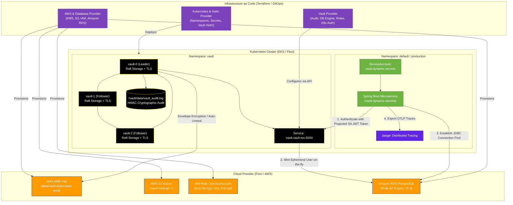

# Production Terraform & GitOps Deployment Guide for HashiCorp Vault HA, Dynamic Secrets, Amazon RDS & Secret-Less Kubernetes Auth

This guide provides the **exact enterprise production deployment methodology** using **Terraform (Infrastructure as Code)** to deploy and configure:
- **AWS KMS Customer Master Key (CMK)** with automated key rotation for Vault envelope encryption.
- **AWS S3 Bucket** with object versioning for automated Raft cluster snapshots & disaster recovery.
- **Amazon RDS PostgreSQL (Production) / Automated In-Cluster PostgreSQL (Floci)** fully provisioned and initialized via Terraform.
- **Automated mTLS PKI Certificates** for intra-cluster Raft peer consensus and HTTPS listeners.
- **3-Node High-Availability (HA) HashiCorp Vault Cluster** deployed via the official Helm chart with Raft storage, KMS auto-unseal, and audit storage volumes.
- **Terraform Vault Provider Configuration**: Declaratively provisioning file audit devices, dynamic PostgreSQL database engines, demo & production dynamic roles, least-privilege policies, and Secret-Less Kubernetes authentication.
- **Zero-Code Shift to Real AWS**: 100% executable on **local Floci** while translating seamlessly to **real AWS EKS, AWS KMS, and Amazon RDS** with a single configuration flag (`use_floci = false`).

---

## 1. Enterprise Production Architecture (Terraform Driven)



---

## 2. Why Terraform Replaces Manual CLI Scripts & Manifests

| Manual CLI Approach *(Traditional)* | Production Terraform Approach *(IaC / GitOps)* | Production Benefit |
|---|---|---|
| Running `kubectl apply -f postgres-deployment.yaml` & manual `psql < scripts/schema.sql` | Managed via `postgres.tf` (`aws_db_instance.postgres` on AWS RDS or automated K8s ConfigMap init on Floci) | **Zero manual SQL loading**; database and schema are ready immediately. On real AWS, provisions enterprise **Amazon RDS PostgreSQL Multi-AZ** with KMS encryption. |
| Running `aws kms create-key` via bash | Declared as `aws_kms_key.vault_unseal` | Idempotency, drift detection, and automated key rotation (`enable_key_rotation = true`). |
| Generating TLS certs via manual `openssl` | Managed via `tls_self_signed_cert` and `tls_locally_signed_cert` | Zero manual cert copying; automatically bundles Subject Alternative Names (SANs) for all Raft nodes. |
| Running `helm upgrade --install` with manual `sed` substitutions | Managed via `helm_release.vault` with dynamic HCL `yamlencode` values | Automated dependency ordering (`depends_on`), zero templating errors, version locking. |
| Executing `./scripts/k8s-vault-setup.sh` via pod exec | Managed via official `hashicorp/vault` Terraform Provider | Secrets engines, dynamic database roles, policies, and Kubernetes auth backends are tracked in state and version-controlled. |

---

## 3. Terraform Code Structure in Repository

All production Terraform configurations are organized under `vault-dynamic-secrets/terraform/`:

```text
terraform/
├── main.tf              # Provider definitions (AWS, Kubernetes, Helm, Vault, TLS)
├── variables.tf         # Parameterized configuration with defaults
├── terraform.tfvars     # Environment values (Floci vs. Real AWS)
├── kms.tf               # AWS KMS CMK & S3 Backup Bucket definitions
├── iam.tf               # IAM least-privilege policy and access credentials
├── tls.tf               # Automated mTLS CA & Server Certificate generator
├── postgres.tf          # Amazon RDS PostgreSQL (AWS) / In-Cluster DB (Floci)
├── vault_helm.tf        # 3-Node Raft HA Helm chart deployment with KMS Auto-Unseal
├── vault_config.tf      # Vault API configuration (Audit, DB Engine, Roles, Policies, K8s Auth)
└── outputs.tf           # KMS Key ID, ARNs, Database Endpoints, and Helm release outputs
```

---

## 4. Step-by-Step Production Execution Runbook

### Phase 1: Infrastructure & Database Provisioning (KMS, S3, RDS/DB, TLS, Vault HA)

Ensure Floci / EKS is active, navigate to the Terraform directory, and initialize providers:

```bash
cd terraform

# 1. Initialize Terraform Providers
terraform init

# 2. Extract Floci Docker Container Bridge IP for local in-cluster pod networking
FLOCI_CONTAINER_IP=$(docker inspect -f '{{range .NetworkSettings.Networks}}{{.IPAddress}}{{end}}' floci 2>/dev/null || echo "127.0.0.1")
export TF_VAR_floci_pod_kms_endpoint="http://${FLOCI_CONTAINER_IP}:4566"

# 3. Apply Phase 1: KMS, IAM, S3, Database (RDS/Postgres), TLS Secrets, and Vault HA Helm Deployment
terraform apply \
  -target=aws_kms_key.vault_unseal \
  -target=aws_kms_alias.vault_unseal_alias \
  -target=aws_s3_bucket.vault_backups \
  -target=aws_s3_bucket_versioning.vault_backups_versioning \
  -target=aws_iam_policy.vault_unseal_policy \
  -target=aws_iam_user.vault_unseal \
  -target=aws_iam_user_policy_attachment.vault_unseal_attach \
  -target=aws_iam_access_key.vault_unseal_key \
  -target=kubernetes_namespace.vault \
  -target=kubernetes_secret.floci_credentials \
  -target=kubernetes_secret.tls_ca \
  -target=kubernetes_secret.tls_server \
  -target=kubernetes_config_map.postgres_schema \
  -target=kubernetes_deployment.postgres \
  -target=kubernetes_service.postgres \
  -target=helm_release.vault \
  -auto-approve
```

#### Detailed Command Breakdown:

##### `terraform init`
- **Why we are executing**: Downloads and caches the required official provider binaries (`hashicorp/aws`, `hashicorp/kubernetes`, `hashicorp/helm`, `hashicorp/vault`, and `hashicorp/tls`).
- **What happens if we don't execute**: Terraform will fail immediately with `Error: Could not load plugin`.
- **What is the use / Result**: Prepares the working directory and locks provider dependency versions in `.terraform.lock.hcl`.

##### `terraform apply -target=... (Phase 1)`
- **Why we are executing**: Provisions the entire cloud, database, and cluster infrastructure in a single step:
  1. **AWS KMS Key** (`alias/vault-autounseal-prod`) with automated key rotation.
  2. **AWS S3 Bucket** (`vault-backups-vault-floci`) with object versioning.
  3. **PostgreSQL Database** (`postgres.tf`): Deploys Amazon RDS Multi-AZ on real AWS, or automated in-cluster PostgreSQL with `init.sql` schema on Floci.
  4. **Mutual TLS Root CA and Server Certificates** with SANs for `*.vault-internal`.
  5. **HashiCorp Vault 3-node HA Raft cluster Helm chart**.
- **What happens if we don't execute**: No database, Vault cluster, or encryption keys will exist in the environment.
- **What is the use / Result**: Creates all infrastructure and database resources in a single declarative transaction.

---

### Phase 2: One-Time Cryptographic Initialization (Day-0 SecOps Gate)

In enterprise production, initialization is performed **once per cluster lifecycle** by authorized security officers to establish the master encryption keyring and capture recovery keys:

```bash
# Check initial uninitialized status
kubectl exec vault-0 -n vault -- vault status

# Perform one-time initialization with 5 recovery shares and 3 recovery threshold
kubectl exec vault-0 -n vault -- \
  vault operator init -format=json > vault-init.json
chmod 600 vault-init.json

# Wait for KMS Auto-Unseal and Raft quorum synchronization
sleep 5

# Verify status (shows Initialized: true, Sealed: false, HA Mode: active)
kubectl exec vault-0 -n vault -- vault status

# Verify Raft peers
VAULT_ROOT_TOKEN=$(jq -r '.root_token' vault-init.json)
kubectl exec vault-0 -n vault -- env VAULT_TOKEN="$VAULT_ROOT_TOKEN" vault operator raft list-peers
```

#### Detailed Command Breakdown:

##### `kubectl exec vault-0 -n vault -- vault operator init -format=json > vault-init.json`
- **Why we are executing**: Generates the root master encryption key. Because AWS KMS auto-unseal is configured, Vault generates **recovery keys** (used for emergency recovery quorum) and an **initial root token**.
- **What happens if we don't execute**: Vault remains uninitialized and sealed; it cannot accept API calls or store secrets.
- **What is the use / Result**: Initializes the Raft cluster, triggers automatic KMS unsealing across all 3 nodes, and saves credentials securely to `vault-init.json`.

---

### Phase 3: Automated Vault Configuration via Terraform Provider

Now that Vault is unsealed and active, use the **Terraform Vault Provider** to declaratively provision all secret engines, roles, policies, and auth methods:

```bash
# Extract the root token
VAULT_ROOT_TOKEN=$(jq -r '.root_token' vault-init.json)

# Establish local port forward to Vault API
kubectl port-forward svc/vault 8200:8200 -n vault &
PF_PID=$!
sleep 2

# Apply Phase 2: Audit Logging, Dynamic DB Engine, Roles, Policies, and Kubernetes Auth
terraform apply \
  -var="vault_token=${VAULT_ROOT_TOKEN}" \
  -var="vault_address=https://127.0.0.1:8200" \
  -var="vault_skip_tls_verify=true" \
  -auto-approve

# Terminate port-forward
kill $PF_PID 2>/dev/null || true
```

#### Detailed Command Breakdown:

##### `terraform apply -var="vault_token=..." (Phase 2)`
- **Why we are executing**: Uses the official `hashicorp/vault` Terraform provider to configure Vault via its REST API:
  1. **Audit Logging (`vault_audit.file_audit`)**: Enables tamper-evident cryptographic HMAC logging to `/vault/data/vault_audit.log`.
  2. **Database Secrets Engine (`vault_mount.db`)**: Enables dynamic PostgreSQL credential generation.
  3. **Database Connection (`vault_database_secret_backend_connection.postgres`)**: Connects Vault to the Terraform-provisioned PostgreSQL database with admin credentials.
  4. **Demo Role (`vault_database_secret_backend_role.payments_app`)**: TTL `1m` / `2m` for demonstration rotation testing.
  5. **Production Role (`vault_database_secret_backend_role.payments_app_prod`)**: TTL `1h` (`3600s`) / `24h` (`86400s`) for production workloads.
  6. **Least-Privilege Policy (`vault_policy.payments_app_policy`)**: Restricts capabilities to reading dynamic credentials and revoking leases.
  7. **Secret-Less Kubernetes Auth (`vault_auth_backend.kubernetes` & `vault_kubernetes_auth_backend_role.payments_app_role`)**: Binds Kubernetes ServiceAccount `vault-dynamic-secrets` to the security policy.
- **What happens if we don't execute**: Vault will lack the database engine, dynamic roles, and Kubernetes authentication backend.
- **What is the use / Result**: Completely provisions all Vault business configurations declaratively with full state tracking.

---

### Phase 4: Deploy Jaeger & Spring Boot Microservice

Because PostgreSQL and its schema were already provisioned in Phase 1 via Terraform, you only deploy Jaeger and the application:

```bash
cd ..

# 1. Deploy Jaeger Distributed Tracing
kubectl apply -f k8s/jaeger-deployment.yaml
kubectl wait --for=condition=Ready pod -l app=jaeger -n default --timeout=60s

# 2. Generate Java JKS Truststore for Spring Boot
JAVA_HOME=$(/usr/libexec/java_home 2>/dev/null || echo "$JAVA_HOME")
"${JAVA_HOME}/bin/keytool" -import -trustcacerts -noprompt -alias vault-ca \
  -file tls/ca.crt -keystore tls/vault-truststore.jks -storepass changeit

kubectl create secret generic vault-truststore \
  --from-file=vault-truststore.jks=tls/vault-truststore.jks \
  -n default \
  --dry-run=client -o yaml | kubectl apply -f -

# 3. Package and Load Application Container Image
mvn clean package -DskipTests
docker build -t vault-dynamic-secrets:latest .
docker save vault-dynamic-secrets:latest | docker exec -i floci-eks-vault-floci ctr -n k8s.io images import -

# 4. Apply Kubernetes Deployment
kubectl apply -f k8s/deployment.yaml
kubectl rollout status deployment/vault-dynamic-secrets -n default --timeout=90s
```

#### Detailed Command Breakdown:

##### `keytool -import ... & kubectl create secret generic vault-truststore ...`
- **Why we are executing**: Imports the private Vault CA certificate into a Java KeyStore (JKS) and mounts it into the application pod at `/workspace/vault-truststore.jks`.
- **What happens if we don't execute**: The JVM will reject Vault's HTTPS connection with `SSLHandshakeException: PKIX path building failed`.
- **What is the use / Result**: Enables secure TLS communication between Spring Cloud Vault and the Vault server.

##### `kubectl apply -f k8s/deployment.yaml` & `kubectl rollout status ...`
- **Why we are executing**: Deploys the microservice configured for `spring.cloud.vault.authentication=KUBERNETES`.
- **What happens if we don't execute**: The microservice workload is not deployed.
- **What is the use / Result**: Pod launches, authenticates to Vault using its projected ServiceAccount JWT token, receives an ephemeral PostgreSQL user (`v-kubernet-payments-...`), establishes a HikariCP connection pool, and enters `1/1 Running` status.

---

### Phase 5: Telemetry, Observability & Verification

Verify dynamic credential rotation and distributed tracing:

```bash
# 1. Query Custom Telemetry Actuator Endpoint
kubectl port-forward svc/vault-dynamic-secrets 8080:8080 -n default &
curl -s http://localhost:8080/actuator/vaultLease | jq .

# 2. Open Jaeger Distributed Tracing UI
kubectl port-forward svc/jaeger 16686:16686 -n default &
# Open http://localhost:16686 in your browser

# 3. Stream Real-Time Dynamic Rotation Logs
kubectl logs -l app=vault-dynamic-secrets -n default -f

# 4. Stream Cryptographic Audit Log from Vault Leader
kubectl exec -n vault vault-0 -- tail -f /vault/data/vault_audit.log
```

---

## 5. Switching from Floci to 100% Real AWS Production (with Amazon RDS)

To deploy this exact setup to real AWS EKS, AWS KMS, and Amazon RDS PostgreSQL, simply edit `terraform/terraform.tfvars`:

```hcl
# ==============================================================================
# REAL AWS PRODUCTION CONFIGURATION
# ==============================================================================
use_floci          = false                         # Disables Floci mock endpoints
aws_region         = "us-east-1"
eks_cluster_name   = "production-eks-cluster"      # Your real AWS EKS Cluster
kubeconfig_path    = "~/.kube/config"

# Database Configuration
postgres_port           = 5432
postgres_db             = "payments"
postgres_admin_user     = "vault_admin"
postgres_admin_password = "SecureProductionPassword123!"

vault_replicas     = 3
vault_image_tag    = "1.18.2"
```

Then run standard Terraform commands:

```bash
terraform init
terraform plan
terraform apply
```

### What Happens Automatically on Real AWS:
1. **Amazon RDS Multi-AZ**: Real Amazon RDS PostgreSQL 16.3 Multi-AZ database cluster created with 20GB-100GB autoscaling storage, encrypted at rest via AWS KMS CMK (`aws_db_instance.postgres`).
2. **AWS KMS**: Real Customer Master Key (CMK) with automated annual rotation created in AWS KMS (`alias/vault-autounseal-prod`).
3. **AWS S3**: Real Amazon S3 bucket created with AES-256 server-side encryption and versioning.
4. **IRSA (IAM Roles for Service Accounts)**: Vault authenticates to AWS KMS via OpenID Connect (OIDC) federation — **zero static AWS access keys exist anywhere**.
5. **Dynamic Secret Provisioning**: Vault connects to Amazon RDS Multi-AZ over encrypted TLS, minting ephemeral database users with automatic revocation upon lease expiry.

---

## 6. Teardown & Resource Cleanup

To cleanly remove all resources:

```bash
cd terraform

# Destroy Vault configurations, database, and infrastructure via Terraform
terraform destroy -auto-approve

# Teardown applications and emulator
kubectl delete -f ../k8s/deployment.yaml -n default --ignore-not-found
kubectl delete -f ../k8s/jaeger-deployment.yaml -n default --ignore-not-found
docker compose -f ../docker-compose-floci.yml down
```
