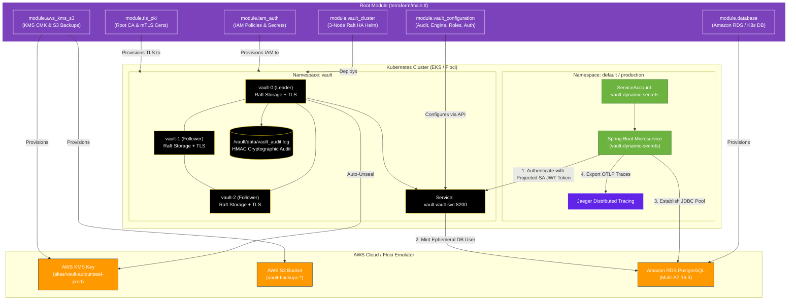

# Production Modular Terraform & GitOps Guide for HashiCorp Vault HA, Dynamic Secrets, Amazon RDS & Kubernetes Auth

This guide provides the **exact enterprise modular Terraform architecture** for deploying:
- **`modules/aws_kms_s3`**: AWS KMS Customer Master Key (CMK) with automated key rotation & versioned S3 disaster recovery bucket.
- **`modules/iam_auth`**: Least-privilege IAM policy and credentials secret.
- **`modules/tls_pki`**: Automated mTLS Root CA & Server Certificates with Subject Alternative Names (SANs) for all Raft nodes (`*.vault-internal`).
- **`modules/database`**: Amazon RDS PostgreSQL Multi-AZ (Production AWS) or automated in-cluster PostgreSQL with schema initialization (Floci).
- **`modules/vault_cluster`**: 3-Node Raft High-Availability (HA) HashiCorp Vault Helm release with KMS auto-unseal and audit volumes.
- **`modules/vault_configuration`**: Declarative Vault API provisioning (file audit device, dynamic PostgreSQL database engine, demo & prod dynamic roles, least-privilege policies, and Secret-Less Kubernetes Auth).
- **Zero-Code Shift to Real AWS**: 100% executable on **local Floci** while translating seamlessly to **real AWS EKS, AWS KMS, and Amazon RDS** by changing `use_floci = false` in `terraform.tfvars`.

---

## 1. Modular Architecture Overview



---

## 2. Directory Structure of the Terraform Modules

```text
terraform/
├── main.tf                    # Root composition invoking modules
├── variables.tf               # Root input variables
├── terraform.tfvars           # Environment configuration
├── outputs.tf                 # Root outputs aggregating module results
│
└── modules/
    ├── aws_kms_s3/            # Module 1: AWS KMS CMK & S3 Backup Bucket
    │   ├── main.tf
    │   ├── variables.tf
    │   └── outputs.tf
    │
    ├── iam_auth/              # Module 2: IAM Policies & K8s Credential Secret
    │   ├── main.tf
    │   ├── variables.tf
    │   └── outputs.tf
    │
    ├── tls_pki/               # Module 3: Automated mTLS Root CA & Server Certs
    │   ├── main.tf
    │   ├── variables.tf
    │   └── outputs.tf
    │
    ├── database/              # Module 4: Amazon RDS PostgreSQL (AWS) / In-Cluster DB (Floci)
    │   ├── main.tf
    │   ├── variables.tf
    │   └── outputs.tf
    │
    ├── vault_cluster/         # Module 5: 3-Node Raft HA Helm Release with KMS Auto-Unseal
    │   ├── main.tf
    │   ├── variables.tf
    │   └── outputs.tf
    │
    └── vault_configuration/   # Module 6: Vault Audit, DB Engine, Roles, Policies & K8s Auth
        ├── main.tf
        ├── variables.tf
        └── outputs.tf
```

---

## 3. Step-by-Step Execution Runbook

### Phase 1: Infrastructure & Database Provisioning via Modules

Ensure Floci / EKS is active, navigate to the Terraform directory, and initialize modules:

```bash
cd terraform

# 1. Initialize Terraform Providers and Local Modules
terraform init

# 2. Extract Floci Docker Container Bridge IP for local in-cluster pod networking
FLOCI_CONTAINER_IP=$(docker inspect -f '{{range .NetworkSettings.Networks}}{{.IPAddress}}{{end}}' floci 2>/dev/null || echo "127.0.0.1")
export TF_VAR_floci_pod_kms_endpoint="http://${FLOCI_CONTAINER_IP}:4566"

# 3. Apply Phase 1: KMS, IAM, S3, Database, TLS, and Vault HA Cluster Modules
terraform apply \
  -target=module.aws_kms_s3 \
  -target=module.tls_pki \
  -target=module.iam_auth \
  -target=module.database \
  -target=module.vault_cluster \
  -auto-approve
```

#### Detailed Command Breakdown:

##### `terraform init`
- **Why we are executing**: Recursively indexes and initializes all local modules (`module.aws_kms_s3`, `module.tls_pki`, `module.iam_auth`, `module.database`, `module.vault_cluster`, `module.vault_configuration`) and downloads required provider plugins.
- **What happens if we don't execute**: Terraform will fail with `Error: Module not installed`.
- **What is the use / Result**: Prepares the workspace with all module dependency trees loaded.

##### `terraform apply -target=module.... (Phase 1)`
- **Why we are executing**: Provisions all foundational infrastructure through clean module interfaces:
  - `module.aws_kms_s3`: Provisions the KMS CMK and S3 backup bucket.
  - `module.tls_pki`: Generates root CA, server certificates, and mounts Kubernetes secrets.
  - `module.iam_auth`: Configures IAM permissions and credentials secret.
  - `module.database`: Provisions Amazon RDS Multi-AZ on real AWS or in-cluster PostgreSQL with schema on Floci.
  - `module.vault_cluster`: Deploys the 3-node Raft HA Vault Helm release.
- **What happens if we don't execute**: No infrastructure or Vault pods will be created.
- **What is the use / Result**: Launches all infrastructure, databases, and Vault StatefulSet pods in a single declarative transaction.

---

### Phase 2: One-Time Cryptographic Initialization (Day-0 SecOps Gate)

In enterprise production, initialization is performed **once per cluster lifecycle** by authorized security officers:

```bash
# Check initial uninitialized status
kubectl exec vault-0 -n vault -- vault status

# Perform one-time initialization with 5 recovery shares and 3 recovery threshold
kubectl exec vault-0 -n vault -- \
  vault operator init -format=json > vault-init.json
chmod 600 vault-init.json

# Wait for KMS Auto-Unseal and Raft quorum synchronization
sleep 5

# Verify status (shows Initialized: true, Sealed: false, HA Mode: active)
kubectl exec vault-0 -n vault -- vault status

# Verify Raft peers across all 3 nodes
VAULT_ROOT_TOKEN=$(jq -r '.root_token' vault-init.json)
kubectl exec vault-0 -n vault -- env VAULT_TOKEN="$VAULT_ROOT_TOKEN" vault operator raft list-peers
```

---

### Phase 3: Automated Vault Configuration via Module

Configure audit logging, database dynamic secrets, roles, policies, and Kubernetes authentication:

```bash
# Extract the root token
VAULT_ROOT_TOKEN=$(jq -r '.root_token' vault-init.json)

# Establish local port forward to Vault API
kubectl port-forward svc/vault 8200:8200 -n vault &
PF_PID=$!
sleep 2

# Apply Phase 2: module.vault_configuration
terraform apply \
  -var="vault_token=${VAULT_ROOT_TOKEN}" \
  -var="vault_address=https://127.0.0.1:8200" \
  -var="vault_skip_tls_verify=true" \
  -auto-approve

# Terminate port-forward
kill $PF_PID 2>/dev/null || true
```

#### Detailed Command Breakdown:
- **Why we are executing**: Invokes `module.vault_configuration` to configure the Vault API declaratively:
  1. File audit device (`/vault/data/vault_audit.log`).
  2. PostgreSQL dynamic secrets engine with admin connection pool.
  3. Demo DB role (1m/2m TTL) and production DB role (1h/24h TTL).
  4. Least-privilege policy `payments-app-policy`.
  5. Secret-Less Kubernetes Auth bound to ServiceAccount `vault-dynamic-secrets`.
- **What happens if we don't execute**: Vault will lack the dynamic secrets engine and Kubernetes auth backend, causing microservices to fail startup.
- **What is the use / Result**: Provisions all Vault business logic and tracks state in Terraform.

---

### Phase 4: Deploy Jaeger & Spring Boot Microservice

```bash
cd ..

# 1. Deploy Jaeger Distributed Tracing
kubectl apply -f k8s/jaeger-deployment.yaml
kubectl wait --for=condition=Ready pod -l app=jaeger -n default --timeout=60s

# 2. Generate Java JKS Truststore for Spring Boot
JAVA_HOME=$(/usr/libexec/java_home 2>/dev/null || echo "$JAVA_HOME")
"${JAVA_HOME}/bin/keytool" -import -trustcacerts -noprompt -alias vault-ca \
  -file tls/ca.crt -keystore tls/vault-truststore.jks -storepass changeit

kubectl create secret generic vault-truststore \
  --from-file=vault-truststore.jks=tls/vault-truststore.jks \
  -n default \
  --dry-run=client -o yaml | kubectl apply -f -

# 3. Package and Load Application Container Image
mvn clean package -DskipTests
docker build -t vault-dynamic-secrets:latest .
docker save vault-dynamic-secrets:latest | docker exec -i floci-eks-vault-floci ctr -n k8s.io images import -

# 4. Apply Kubernetes Deployment
kubectl apply -f k8s/deployment.yaml
kubectl rollout status deployment/vault-dynamic-secrets -n default --timeout=90s
```

---

### Phase 5: Telemetry, Observability & Verification

```bash
# 1. Query Custom Telemetry Actuator Endpoint
kubectl port-forward svc/vault-dynamic-secrets 8080:8080 -n default &
curl -s http://localhost:8080/actuator/vaultLease | jq .

# 2. Open Jaeger Distributed Tracing UI (http://localhost:16686)
kubectl port-forward svc/jaeger 16686:16686 -n default &

# 3. Stream Dynamic Credential Hot-Swap Logs
kubectl logs -l app=vault-dynamic-secrets -n default -f

# 4. Stream Cryptographic Audit Log
kubectl exec -n vault vault-0 -- tail -f /vault/data/vault_audit.log
```

---

## 4. Switching from Floci to 100% Real AWS Production

To deploy to real AWS EKS, AWS KMS, and Amazon RDS Multi-AZ, update `terraform/terraform.tfvars`:

```hcl
# ==============================================================================
# REAL AWS PRODUCTION CONFIGURATION
# ==============================================================================
environment        = "prod"
use_floci          = false                         # Disables Floci mock endpoints
aws_region         = "us-east-1"
eks_cluster_name   = "production-eks-cluster"      # Your real AWS EKS Cluster
kubeconfig_path    = "~/.kube/config"

postgres_port           = 5432
postgres_db             = "payments"
postgres_admin_user     = "vault_admin"
postgres_admin_password = "SecureProductionPassword123!"

vault_replicas     = 3
vault_image_tag    = "1.18.2"
```

Then execute:

```bash
terraform init
terraform plan
terraform apply
```

### What Happens Automatically on Real AWS:
1. `module.aws_kms_s3`: Creates real AWS KMS CMK with annual rotation (`alias/vault-autounseal-prod`) and versioned S3 bucket.
2. `module.database`: Provisions **Amazon RDS PostgreSQL 16.3 Multi-AZ** with 20GB-100GB autoscaling storage, encrypted at rest via AWS KMS.
3. `module.vault_cluster`: Deploys Vault HA across multiple AWS Availability Zones.
4. `module.vault_configuration`: Automatically links Vault to the Amazon RDS cluster endpoint.

---

## 5. Teardown & Resource Cleanup

```bash
cd terraform

# Destroy all modules, databases, and Vault infrastructure
terraform destroy -auto-approve

# Teardown workloads and emulator
kubectl delete -f ../k8s/deployment.yaml -n default --ignore-not-found
kubectl delete -f ../k8s/jaeger-deployment.yaml -n default --ignore-not-found
docker compose -f ../docker-compose-floci.yml down
```
